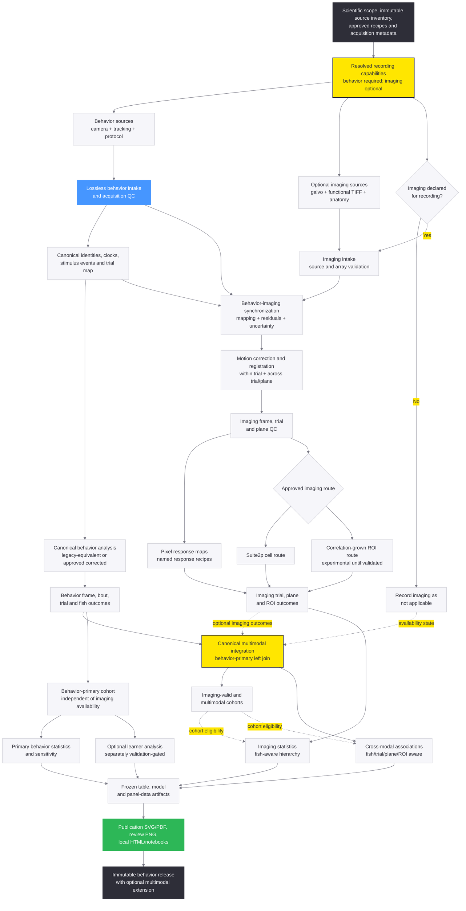
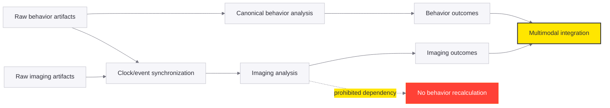
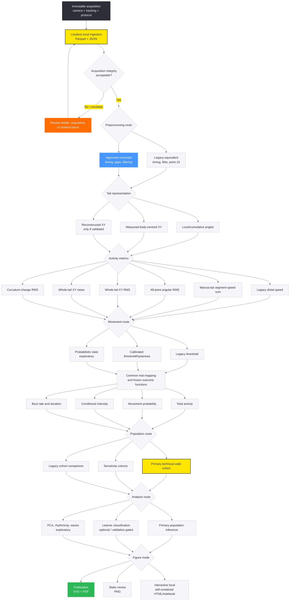
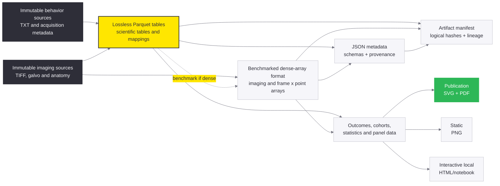

# Analysis Architecture and Alternative Routes

## Final integrated analysis pipeline

This is the intended end state for the entire local analysis. Behavior is the
required primary modality. Imaging is an optional, additive branch available
only for recordings whose resolved acquisition capabilities declare it.



The canonical behavior path does not depend on the imaging capability decision.
The synchronization stage may consume behavior clocks, events, and trial
identity, but no imaging stage may publish or modify behavior artifacts.

The integration stage is a behavior-primary left join. Behavior-only trials stay
in the final table; unavailable or invalid imaging is represented by explicit
availability/QC status and missing imaging values, never biological zero.

Implementation of the optional branch is deferred to
[the behavior and imaging integration plan](./BEHAVIOR_IMAGING_INTEGRATION_PLAN.md).
The inherited imaging implementation is assessed separately in
[the imaging pipeline critique](../docs/analysis/IMAGING_PIPELINE_CRITIQUE.md).

## Modality dependency rule



Required invariant:

```text
logical_hash(behavior outputs | imaging disabled)
    == logical_hash(behavior outputs | imaging enabled)
```

## Detailed behavior branch



All nodes inside this scheme execute locally. There is no Databricks route.

## Final storage architecture



## Route selection rules

| Decision | Available routes | Rule |
| --- | --- | --- |
| Preprocessing | Legacy or corrected | Legacy proves equivalence; corrected requires scientific gate P |
| Legacy downstream transform | Standard `main` route or historical LogMedian route | Characterize separately; neither description overrides executable behavior |
| Tail representation | Angles, measured XY, reconstructed XY | Use measured XY when valid; reconstruct only with proven angle/length semantics |
| Activity metric | Six explicit metrics | Compare as distinct quantities; select using frozen validation |
| Movement state | Legacy, calibrated, probabilistic | Detector identity is independent of metric identity |
| Outcome | Total, probability, conditional, bouts | Complementary outcomes, not interchangeable versions |
| Cohort | Primary, sensitivity, legacy | One explicit manifest per population |
| Analysis | Population, learner, mechanistic | Population is primary; learner/mechanistic routes have separate gates |
| Imaging capability | Not applicable, expected, valid, invalid | Resolve per recording; source presence cannot silently select a route |
| Synchronization | Matched, unmatched, synthesized under approved recovery | Preserve residual and uncertainty; never infer events from fish names |
| Registration | Within-trial, cross-trial/plane, anatomy positioning | Save separately and name the final product consumed downstream |
| Imaging response | Pixel maps, Suite2p cells, correlation-grown ROIs | Distinct scientific methods with separate recipe IDs and gates |
| Multimodal cohort | Imaging-acquired, imaging-valid, multimodal | Never replace or redefine the behavior-primary cohort |
| Multimodal join | Behavior-primary left join | Missing imaging remains unavailable, not zero; reject one-to-many expansion |
| Figure | Publication, static, interactive | Same panel data; presentation mode cannot change science |
