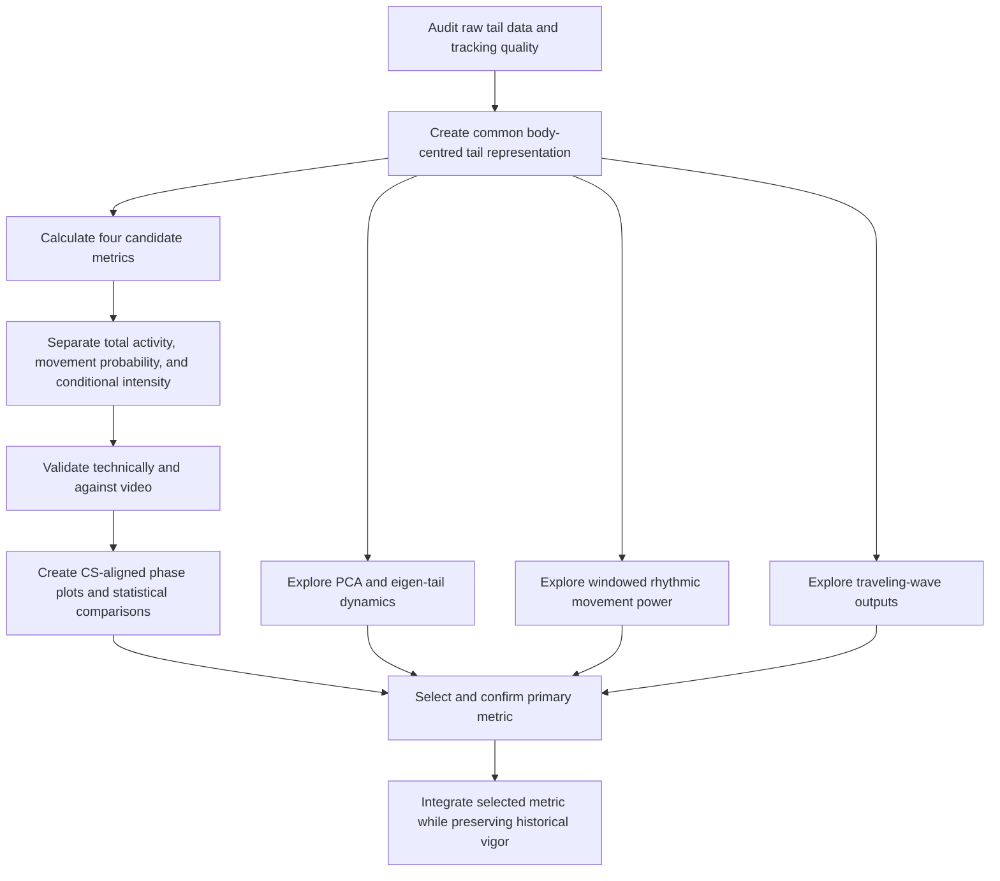

# Tail Dynamics and Vigor Analysis Plan

## Purpose

Test four alternatives to the current distal-point vigor measure and select the measure that best captures learning-related decreases in movement:

1. Whole-tail 2D RMS velocity
2. RMS angular velocity across all points
3. RMS curvature-change rate
4. Mean 2D speed across all points

All four will use equal tail-length weighting. The existing point-15 vigor will be retained as a historical benchmark.

The analysis should distinguish:

- Total activity
- Probability of moving
- Movement intensity when active
- Bout rate and duration
- Rhythmicity and coordination

This distinction matters because learning-related suppression may appear as fewer bouts, weaker bouts, shorter bouts, or less coordinated movement.

## Current vigor

The current pipeline smooths the tail-angle signals, selects the distal angle (normally point 15), and calculates frame-to-frame angular speed. It therefore provides a single distal-point intensity signal and does not directly combine the movement of all tail points.

The current measure should not be overwritten during development. Every new analysis should be compared with it.

## Metric definitions

### 1. Whole-tail 2D RMS velocity

For every frame, calculate the 2D speed of every tail point and combine those speeds using RMS.

This is the leading candidate for overall physical tail motion because it uses the complete tail, includes both image dimensions, and does not cancel when different tail sections move in opposite directions.

### 2. RMS angular velocity across all points

Calculate angular speed for every tail point and combine the values using RMS.

This is the easiest strong improvement because it uses the existing angle data and retains familiar degrees-per-time units. It may, however, count some proximal movements repeatedly because the recorded orientations are cumulative and correlated.

### 3. RMS curvature-change rate

Calculate the local bend at each tail section and measure how quickly each bend changes.

This focuses on active deformation and can detect C-bends, S-bends, and changing bending waves. It should be near zero for a stationary bent tail. It will require careful spatial and temporal smoothing because curvature is sensitive to tracking noise.

### 4. Mean 2D speed across all points

Calculate the 2D speed of every point and combine the speeds using a tail-length-weighted mean.

This is more robust than RMS to one unusually fast point and represents typical movement across the tail. Compared with RMS, it gives less emphasis to brief strong movements.

## Equal tail-length weighting

Each tracked point should represent the portion of tail surrounding it rather than receiving weight simply because it is one point.

Interior points should represent approximately half the distance to the preceding point plus half the distance to the following point. Endpoints should represent half of their neighboring interval.

This makes the metrics less sensitive to the number or spacing of tracked points. It does not force every point to move equally, and the distal tail can still contribute strongly when it genuinely moves farther.

## Overall workflow

## Phase 1 — Audit the available tail data

### Objectives

Establish exactly what tail information is available and which representation is trustworthy.

### Tasks

1. Inspect representative raw files across experiments and rigs.
2. Determine whether actual X/Y coordinates, local segment angles, cumulative orientations, confidence values, or body-axis coordinates are available.
3. Verify the number and spacing of tail points.
4. Check angle conventions, wrapping, frame timestamps, and lost frames.
5. Compare raw angles with the cumulative angles generated during preprocessing.
6. Identify common tracking failures and unusable frames.

### Decision

Use actual tracker X/Y coordinates if they are reliable. Otherwise reconstruct approximate X/Y positions from the available angles and documented segment lengths.

### Deliverable

A data-audit record describing the selected representation, scale, available quality flags, and known limitations.

## Phase 2 — Create a common tail representation

All four metrics must use the same cleaned input so that differences are caused by the metric, not by different preprocessing.

### Body-centred coordinates

For every frame:

1. Place the tail base at a common origin.
2. Align the body axis consistently.
3. Express each point relative to the body-centred reference.

This removes camera movement, slight body displacement, and changes in body orientation. The correction may be small for head-fixed animals, but it should still be tested.

### Timing

Use the measured interval between frames where available rather than assuming exactly 1/700 second. Do not interpolate across long gaps; mark those regions invalid.

### Angle handling

Correct angle wrapping, preserve local orientations where possible, and derive local curvature from neighboring orientations.

### Smoothing

Use consistent light temporal smoothing before velocity calculations and light spatial smoothing before curvature calculations. Do not smooth across large gaps or use information from outside the relevant trial.

Perform a sensitivity analysis across several reasonable smoothing strengths.

Pilot status: temporal detector smoothing has been evaluated locally at 0, 10,
and 20 ms for all five implemented activity metrics, with thresholds
recalibrated independently for each variant. Movement fraction, bout count, and
US positive-control contrast change materially across settings, so no smoothing
strength is selected. This single-fish result must be replicated and combined
with trace/video review and spatial-smoothing sensitivity before approval.

### Scaling

Express reconstructed distances relative to total tail length or body length so 2D metrics are comparable across fish.

### Deliverable

A validated body-centred tail array containing point locations, orientations, validity flags, and tail-length weights for every usable frame.

## Phase 3 — Calculate the four candidate metrics

Calculate all four candidates in parallel and retain the current distal-point vigor.

For each frame, store:

- Current distal-point vigor
- Whole-tail 2D RMS velocity
- All-point RMS angular velocity
- RMS curvature-change rate
- Mean whole-tail 2D speed
- Tracking-quality flags
- Fraction of valid tail length
- Number of valid points

### Missing points

Renormalize weights over the valid tail length when a small part of the tail is missing. Mark frames invalid when too little of the tail remains.

### Outliers

Detect implausible single-point jumps before combining point speeds. Compare ordinary RMS with an outlier-filtered version, while avoiding suppression of genuine strong movements.

### Deliverable

A per-frame candidate-metric dataset linked to fish, trial, stimulus events, phase, and tracking quality.

## Phase 4 — Represent movement in three complementary ways

### Total activity

Retain each candidate continuously, including rest periods. Summarize the average or integrated activity in each time bin and experimental window.

This is likely the most direct measure of overall suppression because it captures both fewer active frames and weaker movement.

### Movement probability

Create an active/rest classification and calculate:

- Probability of movement per time bin
- Fraction of time moving
- Bout initiation rate
- Bout duration
- Interbout interval

Thresholds should be calibrated using tracking noise and manually reviewed video. A probabilistic two-state model can be explored later as an alternative to a hard threshold.

### Conditional movement intensity

Calculate the average candidate metric only during movement periods.

This answers whether movement itself becomes weaker when the fish does move.

### Suppression decomposition

Classify decreases as:

- Probability-driven: fewer movements with similar bout strength
- Intensity-driven: similar movement frequency with weaker bouts
- Both
- Coordination-driven: similar gross movement but less rhythmic or organized movement

### Deliverable

For each candidate and experimental unit:

- Total activity
- Movement probability
- Conditional intensity
- Bout rate
- Bout duration

## Phase 5 — Technical and biological validation

### Synthetic validation

Test known patterns:

- Stationary straight tail
- Stationary bent tail
- Rigid translation without bending
- Single C-bend
- S-bend with opposing section movements
- Base-to-tip traveling bend
- Single-point tracking spike
- Missing distal points
- Different point densities
- Different frame rates

Define expected behavior before inspecting the results.

### Video validation

Use a blinded, balanced sample containing rest, weak bouts, strong bouts, C-bends, S-bends, rhythmic swimming, struggle-like movement, and tracking errors.

Observers should annotate movement/rest, relative strength, bout boundaries, and coordinated versus irregular movement.

Compare all candidate metrics with these annotations.

### Positive controls

Use known US-evoked movement as a positive control. Each metric should detect the response, locate its onset and peak, and remain stable during quiet pre-CS periods.

### Robustness checks

Repeat analyses after changing:

- Smoothing strength
- Number of tail points
- Inclusion or exclusion of the final point
- Inclusion or exclusion of proximal points
- Outlier handling
- Movement threshold
- Time-bin width

### Deliverable

A validation scorecard for all four candidates.

## Phase 6 — CS-aligned phase plots

Use the visual structure of the supplied example: a 3×3 grid of experimental phases with matching time axes, shaded stimulus intervals, group lines, and uncertainty bands.

### Panels

Use the relevant phases:

- Pre-train
- Train 1–5
- Test 1–3

### Time alignment

Align time to CS onset. Show:

- Pre-CS interval
- CS interval
- Trace interval
- Expected US onset
- Immediate and late post-US intervals where appropriate

Exact windows should come from the experiment configuration rather than being globally hard-coded.

### Plot families

For each candidate, produce:

1. Total-activity time course
2. Movement-probability time course
3. Conditional-intensity time course
4. Per-fish window summaries
5. Pre-CS-to-anticipatory suppression summaries
6. Candidate agreement plots

Use raw-unit plots for interpretation and baseline differences or standardized effect sizes for comparing metrics. Avoid ratios when baseline activity is close to zero.

### Uncertainty

Confidence bands and statistical summaries should be based on fish-level variability rather than treating thousands of frames as independent observations.

## Phase 7 — PCA and eigen-tail dynamics

This is a separate exploratory analysis of coordinated tail shapes.

### Method

1. Use body-centred tail angles or curvature.
2. Remove the mean posture.
3. Apply tail-length weighting.
4. Fit one common PCA basis across groups and phases.
5. Balance the training data so no group or phase defines the modes.
6. Retain enough modes to represent meaningful shape variation without retaining point noise.

### Outputs

- Eigen-tail shapes for positive and negative mode values
- Explained-variance plot
- Per-frame mode amplitudes
- Velocity through PCA shape space
- Combined modal velocity
- PC1–PC2 density plots
- Shape-space trajectories
- Mode occupancy by phase and group

### Phase-grid plots

Plot total eigen-tail velocity in the same 3×3 format as the uploaded figure. Also plot individual mode velocities and mode occupancy across pre-CS, CS, trace, and post-US windows.

### Interpretation

PCA may show that total movement decreases, or that the amount of movement remains similar while the type of coordinated tail shape changes.

## Phase 8 — Windowed rhythmic movement power

This analysis asks whether the tail is oscillating rhythmically and how strong that oscillation is.

### Input

Test both:

- Tail curvature
- Body-centred lateral displacement

### Window selection

Compare short, intermediate, and long windows. Short windows provide better timing but poorer frequency resolution; long windows provide better frequency resolution but blur stimulus timing.

Choose the main window using observed bout lengths and tail-beat frequencies.

### Outputs

- Total movement power
- Power in the main biological tail-beat band
- Dominant frequency
- Fraction of movement that is rhythmic
- Spatial coherence across tail sections
- Frequency changes across experimental phases

### Plots

Produce:

1. Phase-grid band-power plots
2. Time-frequency heatmaps
3. Window summaries for pre-CS, CS, trace, and post-US
4. Dominant-frequency plots
5. Rhythmicity and coherence plots

### Interpretation

Reduced rhythmic power indicates weaker oscillatory movement, but not necessarily less total movement. A single strong bend may produce high 2D movement and little sustained rhythmic power.

## Phase 9 — Traveling-wave energy

Traveling-wave analysis treats curvature as a signal that varies across both tail position and time.

### Main visualization

The first output is a curvature kymograph:

- Horizontal axis: time
- Vertical axis: position from tail base to tip
- Colour: bend direction and amplitude

A propagating bend appears as a diagonal band. Its slope indicates propagation speed.

### Meaning of traveling-wave energy

Traveling-wave energy is the amount of tail movement organized as a coherent wave that propagates along the tail over time.

A high value indicates:

- Strong curvature changes
- Participation of multiple tail sections
- Consistent timing across the tail
- Evidence of propagation rather than isolated movement

A low value can indicate:

- Little movement
- Movement restricted to one section
- Irregular or uncoordinated movement
- A stationary bend
- Movement without a clear traveling wave

### Natural outputs

Traveling-wave analysis can produce:

- Total traveling-wave energy
- Base-to-tip wave energy
- Tip-to-base wave energy
- Propagation directionality
- Wave speed
- Dominant temporal frequency
- Spatial wavelength
- Coherence
- Wave amplitude

### Behavioral interpretation

| Behavior | Gross 2D movement | Traveling-wave energy |
|---|---:|---:|
| Rest | Low | Low |
| Static C-bend | Low | Low |
| Single abrupt bend | High | Low or moderate |
| Coordinated swimming | High | High |
| Strong irregular struggle | High | Potentially low |
| Weak rhythmic swimming | Moderate | Moderate |
| Single-point tracking spike | Potentially high | Usually low |

### Relevance to learning

Traveling-wave analysis could reveal:

- Reduced movement and reduced wave energy
- Similar movement but reduced coordination
- Fewer waves with unchanged wave amplitude
- Unchanged wave rate but weaker waves
- Changes in propagation direction or speed

It should initially remain exploratory because it measures coordinated propulsive organization rather than all biologically relevant movement.

## Phase 10 — Statistical comparison and metric selection

### Primary biological contrast

Compare pre-CS activity with late-CS and trace activity, where anticipatory suppression is expected.

The key question is which metric reliably captures stimulus-specific suppression in unseen fish while remaining robust and interpretable.

### Statistical structure

Respect the hierarchy:

- Frames within trials
- Trials within fish
- Fish within experimental groups
- Repeated phases or blocks within fish

Use appropriate models for:

- Continuous activity
- Positive skewed intensities
- Binary movement probability
- Proportions or bout occupancy

### Learner stratification

If learner labels were originally defined using distal-point vigor, do not use those labels as the only evidence that a new metric succeeds.

Recommended order:

1. Compare experimental groups first.
2. Select and validate the candidate metric.
3. Revisit learner stratification.
4. If new labels are defined, evaluate them on held-out fish or trials.

### Selection scorecard

Rank candidates on:

1. Detection of anticipatory suppression
2. Stability of effects on held-out data
3. Movement/rest classification
4. Agreement with visual intensity judgments
5. Fish-level repeatability
6. Baseline stability
7. Detection of known US responses
8. Resistance to tracking artifacts
9. Stability across point density and smoothing
10. Fraction of usable frames
11. Interpretability
12. Ease of downstream use

The final result may appropriately be one primary continuous activity measure plus movement probability as a required companion measure.

## Phase 11 — Confirmation and integration

After selecting a candidate:

1. Freeze preprocessing and parameters.
2. Test the selected metric on held-out fish or experiments.
3. Confirm the main group-by-phase-by-window effect.
4. Check robustness across rigs, fish, and smoothing choices.
5. Add the selected metric to the main pipeline.
6. Preserve current point-15 vigor for historical comparison.
7. Recalibrate bout thresholds.
8. Update scaled and normalized analyses.
9. Record units and all preprocessing parameters.
10. Regenerate key figures with old and new vigor.
11. Document which conclusions remain, weaken, or become clearer.

## Recommended order

### Essential first stage

1. Audit data and tracking quality.
2. Create the common body-centred representation.
3. Calculate the four candidate metrics.
4. Calculate total activity, movement probability, and conditional intensity.
5. Validate against synthetic patterns and video.
6. Create CS-aligned phase plots.
7. Compare candidates statistically.

### Exploratory second stage

8. Explore PCA/eigen-tail dynamics.
9. Explore windowed movement power and rhythmicity.

### Mechanistic third stage

10. Explore traveling-wave energy and propagation features.

## Expected outcome

The likely outcome is not necessarily one universal replacement. A scientifically useful final framework may be:

- A primary whole-tail continuous activity measure
- Movement probability as a companion measure
- Conditional intensity to distinguish weaker bouts from fewer bouts
- PCA, power, and traveling-wave features to explain changes in coordination and movement type

The leading candidates for the primary scalar are whole-tail 2D RMS velocity and mean whole-tail 2D speed. RMS should be more sensitive to strong movement peaks; the mean should be more robust and representative of typical tail movement. Curvature-change rate may be the most sensitive to active bending, while all-point angular RMS is the easiest low-risk replacement.
