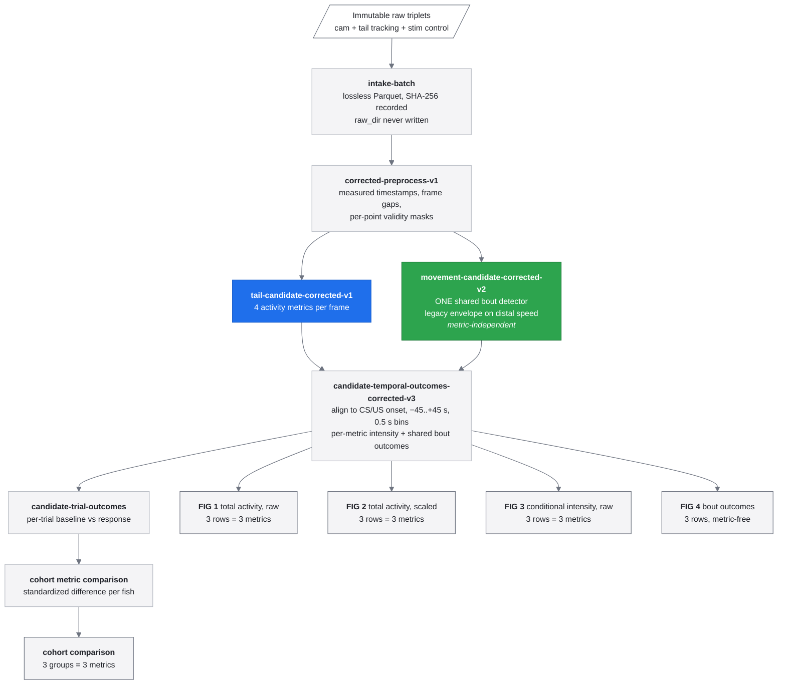

# Classical Conditioning in Larval Zebrafish

Python analysis for a head-fixed larval zebrafish classical-conditioning assay.
The installable package under `src/classical_conditioning` supports the
candidate analysis route. Historical implementations are preserved as
non-executable source reference under `Archive/`.

## Contents

- [Install](#install)
- [Run from a config file](#run-from-a-config-file)
  - [Run configuration fields](#required-config-fields)
  - [Pipeline behaviour and failure semantics](#what-run-pipeline-does)
  - [Raw file rules and save-directory layout](#raw-file-rules)
- [Analysis pipeline architecture](#analysis-pipeline-architecture)
  - [Metrics and shared bouts](#metrics-and-shared-bouts)
- [Command reference](#command-reference)
- [Figures and figure interpretation](#figures)
- [Scientific status and limits](#scientific-status)
- [Repository maintenance](#repository-maintenance)
- [Related documents](#related-documents)
- [Documentation reorganization review](docs/analysis/README_REORGANIZATION.md)

**New to the project?** Read *Install*, *Run from a config file*, and the
*Save-directory layout* first. Use the scientific and figure sections after a
successful run to interpret candidate outputs, not as approval for a result.

For the complete `pipeline.py` call graph and a file-by-file map of the active
package, see [the current pipeline guide](docs/analysis/CURRENT_PIPELINE_GUIDE.md).
For the legacy/refactored figure map, see
[the figure-pipeline inventory](docs/analysis/figures/FIGURE_PIPELINES.md).
For the exact cohort aggregation order, response/baseline figures, and the
legacy-versus-active LME distinction, see
[cohort aggregation and figures](docs/analysis/COHORT_AGGREGATION_AND_FIGURES.md).
For the condition-aware block, trial, onset, and robustness outputs, see
[learning-onset analysis](docs/analysis/LEARNING_ONSET_ANALYSIS.md).
For analysis-readiness and mixed-effects decisions, see
[the analysis and statistics plan](Plans/Analysis/1_ANALYSIS_AND_STATISTICS.md).

## Install

Supported runtime: **CPython ≥ 3.12** on 64-bit Windows. Dependencies are pinned
in `uv.lock`.

### Prerequisites

1. Clone this repository.
2. Install [uv](https://docs.astral.sh/uv/) **or** use **Python 3.12 or 3.13** with `pip`.
   Python 3.14 is not supported yet: `pyarrow` has no compatible wheel and fails
   importing `pyarrow.lib`. Use the project venv (`.venv`) created by `uv sync`.
3. Choose a writable **save directory** with enough free disk space for Parquet
   outputs (order of ~1–2 GB compressed per fish after intake; scale up for
   full cohorts).

### Recommended install (uv)

```powershell
cd "C:\path\to\ClassicalConditioning"
uv sync --frozen --all-extras
uv run python -m unittest discover -s tests
```

`--all-extras` installs the full scientific stack used by tests and optional
figure modes (seaborn, statsmodels, plotly, etc.). The base package alone is
enough for intake and Parquet analysis, but not for the full test suite or
interactive HTML figures.

### Alternative install (pip)

```powershell
python -m pip install -e ".[analysis,interactive]"
python -m classical_conditioning --help
```

Record the environment on each machine:

```powershell
uv run classical-conditioning environment-report `
  --output "<SAVE-DIR>\Metadata\environment.json"
```

## Run from a config file

All relocatable batch work is driven by a JSON file. You set **where raw data
live**, **where to save outputs**, **which experiment**, and **which analysis
routes** to run — then invoke one command.

```powershell
uv run classical-conditioning run-pipeline --config configs\example-run.json
```

Copy [configs/example-run.json](configs/example-run.json) and edit the paths.

### One-command allDelay technical run

For the complete allDelay technical workflow—lossless intake, candidate
analysis, all-complete cohort freeze, learning-onset LME, and both final PNGs—
run the Windows launcher below. It is resumable: re-running the same command
verifies and preserves completed artifacts rather than overwriting them.

```powershell
.\scripts\run-allDelay-full-windows.ps1 `
  -RawDir "J:\Raw Data\allDelay" `
  -ProjectDir "F:\Digested Data\allDelay-full-v1"
```

The launcher creates an explicitly labelled **technical all-complete** cohort
(every complete control/delay triplet). It is not a substitute for a
publication-cohort review. Its final figures are written to
`<ProjectDir>\Figures\PNG\Analyses\allDelay-full-learning-onset-v1\`.

### Required config fields

| Field | Meaning |
| --- | --- |
| `raw_dir` | Folder containing immutable camera / tracking / protocol triplets. Never written. |
| `save_dir` | Writable project tree (`Processed data`, `Quality checks`, `Metadata`, `Figures`). |
| `experiment` | Package experiment id (see table below). |
| `analysis_id` | Label for this run; used in output paths and manifests. |

### Common optional fields

| Field | Default | Meaning |
| --- | --- | --- |
| `routes` | `["candidate"]` | Candidate analysis route. `"legacy"` is retired and rejected. |
| `keep_conditions` | all complete triplets | Filename condition tokens to keep (lowercased). |
| `recording_ids` | null | Explicit fish list; omit to auto-discover under `raw_dir`. |
| `run_inventory` | false | Write `Metadata/recording_inventory.json` before intake. |
| `run_intake` | true | Convert raw triplets to lossless Parquet under `save_dir`. |
| `run_figures` | false | Write cohort metric-comparison PNGs after candidate route. |
| `overwrite` | false | Replace existing derived artifacts. |
| `continue_on_error` | true | Keep going when one fish fails (intake / candidate). |
| `candidate_runner_recipe` | `candidate-corrected-runner-v1` | Six-metric corrected route. |

Candidate cohort outputs use `{analysis_id}-candidate` unless overridden by
`candidate_analysis_id`.

### What `run-pipeline` does

```text
optional inventory
  -> intake-batch (all matching triplets)
  -> [candidate route, default] candidate-runner
         corrected-preprocess-v1 -> three activity metrics -> movement state
         -> temporal outcomes -> trial outcomes -> cohort comparison
  -> [optional] cohort metric-comparison figures
  -> Metadata/<analysis_id>_pipeline_run.json summary
```

`run-pipeline` is the orchestrator: it selects recordings, calls the
versioned analysis stages, and writes their run status. It does not itself
calculate activity or decide a scientific exclusion cohort.

#### Step-by-step behavior

1. **Resolve the recording list.** If `recording_ids` is present, that list is
   authoritative. Otherwise the pipeline discovers complete raw triplets under
   `raw_dir`, then applies `keep_conditions` if supplied. Discovery filters
   files; it does not apply scientific fish exclusions.

2. **Create the save tree.** All derived files are written below `save_dir`.
   `raw_dir` is treated as immutable.

3. **Optionally inventory raw data.** With `run_inventory: true`, the pipeline
   writes `Metadata/recording_inventory.json`, including hashes and triplet
   completeness. This is provenance/QC; intake independently validates inputs,
   so an inventory is not a prerequisite for analysis.

4. **Optionally intake raw triplets.** With `run_intake: true`, each selected
   complete camera/tracking/protocol triplet is converted to lossless Parquet.
   Only recordings that completed intake, or whose existing intake outputs were
   accepted as `skipped`, proceed to downstream routes. If none are usable, the
   pipeline stops. `continue_on_error` controls whether one failed recording
   aborts the run or is recorded as a per-fish failure in the summary.

5. **Run the candidate analysis route.** Start with the default corrected
   route. It uses two source files in this order:

   - `preprocessing/corrected_frame_preprocessing.py` prepares corrected,
     measured-time, gap-aware frames.
   - `preprocessing/candidate_metrics_from_corrected_frames.py` calculates the
     three candidate metrics from those frames and inherits their validity mask.

   The shared metric formula and column schema live in
   `preprocessing/candidate_metric_kernel.py`; the two writers use that one
   implementation and differ only in their input provenance and validity
   policy.

   `preprocessing/benchmarks/candidate_metrics_from_intake.py` is not the normal route.
   It calculates the same three metrics directly from intake artifacts and exists
   only as the active development benchmark for controlled comparison. Do not
   mix its artifacts with corrected-route downstream artifacts.

   - The default `candidate-corrected-runner-v1` selects a frozen compatible
     recipe family:

     ```text
     corrected preprocessing
       -> three activity metrics
       -> one shared movement/bout detector
       -> trial-aligned temporal profiles
       -> per-trial outcomes and coverage
       -> descriptive cohort metric comparison
     ```

     Each stage verifies hashes and recipe identity for its upstream artifacts.
     The candidate route is exploratory; its outputs are not paper-approved.

6. **Optionally render candidate cohort figures.** With `run_figures: true`,
   the pipeline renders the requested metric-comparison outcomes from the
   candidate cohort comparison artifact. It does not make per-recording
   heatmaps; use `figure-candidate-profiles` separately for those.

7. **Write the run ledger.**
   `Metadata/<analysis_id>_pipeline_run.json` records the resolved config,
   final active recording list, intake completion/skips/failures, candidate
   status, and rendered figure paths. It is an audit record of the
   invocation, not a scientific result artifact.

#### Route and failure semantics

- The candidate runner handles failures per recording when
  `continue_on_error: true`; it builds the cohort comparison from the
  recordings that completed every candidate stage.
- `overwrite: false` preserves existing completed artifacts. Stages verify
  their markers and hashes rather than silently reusing edited or mismatched
  upstream outputs.
- Candidate analysis IDs receive a `-candidate` suffix by default.

`run_figures` writes only the **cohort metric-comparison** figure. Per-recording
heatmaps are a separate command (see below).

While a run is in progress, status goes to **stderr** so normal result paths can
still be captured from stdout:

- `==> Stage name` banners for major phases (intake, candidate runner, figures)
- `tqdm` progress bars when several recordings or outcomes are processed
- `> step-name: running / done in …s` flags inside each fish for the five
  candidate stages (preprocess, metrics, movement, temporal profiles, trial outcomes)
- `[i/n] recording-id: completed` per-fish summaries

Use `--quiet` on `run-pipeline`, `candidate-runner`, or `execute-batch` to
suppress this. In JSON configs, set `"show_progress": false` for `run-pipeline`.

Package experiments currently available:

| `experiment` | Conditions | CR window |
| --- | --- | --- |
| `allDelay` | control, delay | 0–9 s |
| `fixedVsIncreasingTrace` | control, fixedtrace | 0–13 s |

### Raw file rules

Intake and inventory recursively search `raw_dir` for complete triplets:

| Kind | Filename suffix |
| --- | --- |
| Camera | `_cam.txt` |
| Tracking | `_mp tail tracking.txt` |
| Protocol | `_stim control.txt` |

- Recording ID = first two `_` fields (`YYYYMMDD_NN`).
- Condition = third `_` field, lowercased.
- `save_dir` must not equal `raw_dir`. If nested inside raw, name it
  `Paper data`.

### Save-directory layout

`save_dir` is the complete, writable derived-data project. The pipeline never
writes to `raw_dir`. Names in angle brackets vary by run; entries in square
brackets are created only when the related command or option is used.

```text
<save_dir>/
|-- Processed data/                         # Machine-readable result tables
|   |-- <recording-id>/                      # One fish, e.g. 20221115_04
|   |   |-- camera.parquet                   # Lossless camera-time intake table
|   |   |-- tracking.parquet                 # Lossless tail-tracking intake table
|   |   |-- stimulus_events.parquet          # Parsed stimulus/protocol events
|   |   |-- corrected_frames*.parquet        # Corrected, gap-aware frame table
|   |   |-- candidate_metrics*.parquet       # Frame-level candidate activity metrics
|   |   |-- movement_state*.parquet          # Shared movement/bout state per frame
|   |   |-- temporal_profiles*.parquet       # Trial-aligned time-bin profiles
|   |   `-- trial_outcomes*.parquet          # One row per trial/outcome
|   |-- Analyses/<analysis-id>/              # Outputs pooled across recordings
|   |   |-- *metric_comparison*.parquet      # Descriptive cohort metric comparison
|   |   |-- *model_input*.parquet            # [candidate-model-input]
|   |   |-- *mixed_effects*.parquet          # [candidate-mixed-effects]
|   |   |-- *fish_permutation*.parquet       # [candidate-fish-permutation]
|   |   |-- *fish_bootstrap*.parquet         # [candidate-fish-bootstrap]
|   |   `-- *learning_onset*.parquet         # [learning-onset analysis]
|   |-- Cohorts/<cohort-id>/                 # [freeze-cohort / cohort outcomes]
|   |   `-- cohort_manifest.parquet          # Frozen reviewed inclusion decisions
|   `-- Batches/<batch-id>/                  # [plan-batch / execute-batch]
|       `-- batch_work_manifest.parquet      # Per-recording stage state for resume
|-- Quality checks/                          # Human-readable QC and validation evidence
|   |-- <recording-id>/
|   |   |-- acquisition_summary.json
|   |   |-- acquisition_report.html
|   |   |-- figures/                         # Intake timing/tracking/protocol PNGs
|   |   `-- *summary*.json                   # Per-stage coverage and QC summaries
|   |-- Analyses/<analysis-id>/              # Cohort/inference diagnostic summaries
|   `-- Cohorts/<cohort-id>/                 # Cohort validation report
|-- Metadata/                                # Provenance, hashes, and completion markers
|   |-- recording_inventory.json             # [run_inventory]
|   |-- <recording-id>_source_manifest.json  # Intake source filenames and hashes
|   |-- <recording-id>_*_complete.json       # Per-stage artifact lineage markers
|   |-- <analysis-id>_*_complete.json        # Cohort/inference lineage markers
|   |-- <analysis-id>_pipeline_run.json      # Config, statuses, and output ledger
|   `-- [environment.json]                   # environment-report output, if requested
`-- Figures/                                 # Rendered, derived visualizations
    |-- PNG/<recording-id>/                   # Static per-fish temporal-profile figures
    |-- PNG/Analyses/<analysis-id>/           # Static cohort/diagnostic figures
    |-- Publication/...                       # SVG/PDF figures plus provenance sidecars
    `-- Interactive/<recording-id>/           # Self-contained HTML profile figures
```

The directories have deliberately separate responsibilities:

| Directory | What belongs there | How to use it |
| --- | --- | --- |
| `Processed data` | Parquet tables used as input to downstream stages | Treat as machine-readable analysis data; do not edit tables in place. |
| `Quality checks` | Summaries, HTML reports, diagnostics, and QC images | Start here when reviewing data health, coverage, or a failed stage. |
| `Metadata` | Source hashes, resolved settings, completion markers, and run ledgers | Retain this with the data: downstream stages use it to verify provenance. |
| `Figures` | Rendered views of already-produced results | Regenerate from the corresponding processed artifacts rather than editing images. |

An asterisk in a filename is intentional: the exact stem contains the frozen
recipe identifier (and sometimes the alignment or outcome), so related artifacts
cannot be silently mixed across recipe families. A `*_complete.json` file is not
just a success flag: it records the expected output hashes and upstream lineage.
Deleting or editing it makes the corresponding result ineligible for reuse until
the stage is rebuilt with the appropriate command.

## Analysis pipeline architecture



Note that metrics and the detector are **siblings**, not a chain: the detector
does not consume the three metrics. It runs once on the distal cumulative-angle
speed — the signal the historical pipeline used — and every metric inherits its
segmentation.

Every stage writes a completion marker containing the SHA-256 of its outputs,
and each stage re-verifies the marker of the stage before it. A stage refuses to
run on stale or edited upstream artifacts rather than silently producing
mismatched results.

### Metrics and shared bouts

The active candidate route carries three exploratory tail-activity metrics and
one metric-independent shared bout detector. Their exact formulas, units,
historical thresholds, outcome conventions, scientific status, and limitations
are documented in [Metrics and bouts](docs/analysis/METRICS_AND_BOUTS.md).

## Command reference

All analysis commands take `--project-dir` (= your `save_dir`). Run
`uv run classical-conditioning <command> --help` for the full flag list.

### Everyday use

| Command | Purpose |
| --- | --- |
| `run-pipeline` | Run everything from one JSON config. **Start here.** |
| `inventory` | Discover and hash raw triplets; report completeness. |
| `intake-batch` | Convert every complete triplet to Parquet. |
| `candidate-runner` | All candidate stages per fish + cohort comparison. |
| `figure-candidate-profiles` | Per-fish metric heatmaps. |
| `figure-metric-comparison` | Cohort metric comparison bars. |
| `environment-report` | Record pinned versions for reproducibility. |

### Individual candidate stages

Useful for debugging or partial reruns, in dependency order:

| Command | Purpose |
| --- | --- |
| `preprocess --recipe corrected-preprocess-v1` | Measured-time frames and validity masks. |
| `activity-metrics --recipe tail-candidate-corrected-v1` | The three per-frame metrics. |
| `movement-state` | Threshold calibration and bout detection. |
| `temporal-profiles` | Trial-aligned 0.5 s bins. |
| `candidate-trial-outcomes` | Per-trial baseline and response. |
| `compare-candidate-metrics` | Cohort metric comparison table. |

### Quality control and diagnostics

| Command | Purpose |
| --- | --- |
| `validate-raw` | Check one triplet before intake. |
| `audit-tracking` | Inventory tracking columns without assuming validity. |
| `compare` | Diff two row-aligned Parquet artifacts. |
| `movement-sensitivity` | Vary detector parameters and report outcome sensitivity. |
| `trace-review` | Balanced trace windows for human detector review. |
| `resolve-config` | Dump resolved recipe JSON and trial map. |

### Cohort, statistics, and batch control

| Command | Purpose |
| --- | --- |
| `freeze-cohort` / `apply-cohort` | Freeze a reviewed fish list, then filter to it. |
| `plan-batch` / `execute-batch` | Deterministic per-recording work plan, then run pending or failed. |
| `candidate-mixed-effects` | Mixed-effects model over candidate outcomes. |
| `candidate-fish-permutation` / `candidate-fish-bootstrap` | Fish-level permutation and bootstrap. |
| `candidate-model-input` | Export the model input table. |

### Historical source archive

The retired package legacy implementation, its tests, numbered scripts, and
historical helper modules are retained under `Archive/` for source review.
They are not installed, exposed through the CLI, or supported as a runnable
workflow.

## Figures

Candidate figures are exploratory views of verified artifacts, not approval for
a scientific result. The [Figure guide](docs/analysis/FIGURE_GUIDE.md) contains
commands, output modes and locations, profile axes, masking/coverage rules,
scaling, colour conventions, provenance, and cohort-figure interpretation.

## Scientific status

- Package outputs are **exploratory** until scientific gates pass.
- Legacy route preserves known old behavior for comparison.
- Candidate route compares three metrics descriptively; no metric is
  paper-approved. `legacy_distal_angular_speed` is a
  measured-time benchmark of the historical formula, not a reproduction of the
  historical pipeline.
- Bout detection is **shared and metric-independent**: one legacy-style
  envelope detector runs on the distal cumulative-angle speed, and every metric
  inherits its segmentation. Bout-derived outcomes therefore describe behavior,
  not detector calibration. The thresholds are historical constants and still
  require a Gate T1 scientific decision and bounded sensitivity analysis;
  manual/video validation is deferred and is not an active completion blocker.
- Cohort figures use fish-equal **standardized difference**
  `(response − baseline) / baseline SD`.

See [the implementation status index](Plans/IMPLEMENTATION_STEP_INDEX.md) and
[activity metric/bout documentation](docs/analysis/METRICS_AND_BOUTS.md) for
current limits.

## Legacy numbered scripts

`Archive/historical-scripts/` and `Archive/historical-helpers/` contain the
historical pipeline (machine-specific paths, in-script `RUN_*` flags). Prefer
`run-pipeline` or the package CLI for new work.

## Related documents

| Document | Contents |
| --- | --- |
| [Plans/IMPLEMENTATION_STEP_INDEX.md](Plans/IMPLEMENTATION_STEP_INDEX.md) | Current implementation status |
| [docs/analysis/README.md](docs/analysis/README.md) | Task-oriented index for workflow, outputs, troubleshooting, metrics, figures, architecture, audits, and legacy references |
| [docs/analysis/USER_WORKFLOW.md](docs/analysis/USER_WORKFLOW.md) | First-run candidate workflow, output review order, safe resume, and manual-stage order |
| [docs/analysis/OUTPUT_AND_PROVENANCE.md](docs/analysis/OUTPUT_AND_PROVENANCE.md) | Output-directory responsibilities, completion markers, hashes, and artifact reuse |
| [docs/analysis/TROUBLESHOOTING.md](docs/analysis/TROUBLESHOOTING.md) | Safe diagnosis and recovery for common runtime, intake, artifact, and detector problems |
| [docs/analysis/FIGURE_GUIDE.md](docs/analysis/FIGURE_GUIDE.md) | Candidate figure commands, output modes, interpretation, and colour/coverage rules |
| [docs/analysis/GLOSSARY.md](docs/analysis/GLOSSARY.md) | Current package terminology |
| [docs/maintenance/REPOSITORY_GUIDE.md](docs/maintenance/REPOSITORY_GUIDE.md) | Active/archive boundaries, generated files, raw-data protection, and documentation maintenance |
| `Archive/` | Read-only historical package and helper source archive |
| [Plans/DECISIONS.md](Plans/DECISIONS.md) | Locked decisions |

Manuscript: `C:\Users\Public\More projects\Paper\Learning paper`

## Repository maintenance

The repository holds supported source, tests, migration documentation, and a
non-runnable historical archive; raw data and ordinary `Paper data` output
trees are configured elsewhere. See the [repository maintenance guide](docs/maintenance/REPOSITORY_GUIDE.md)
for the folder-by-folder cleanup policy, active/archive boundary, and retained
human-review notes.
