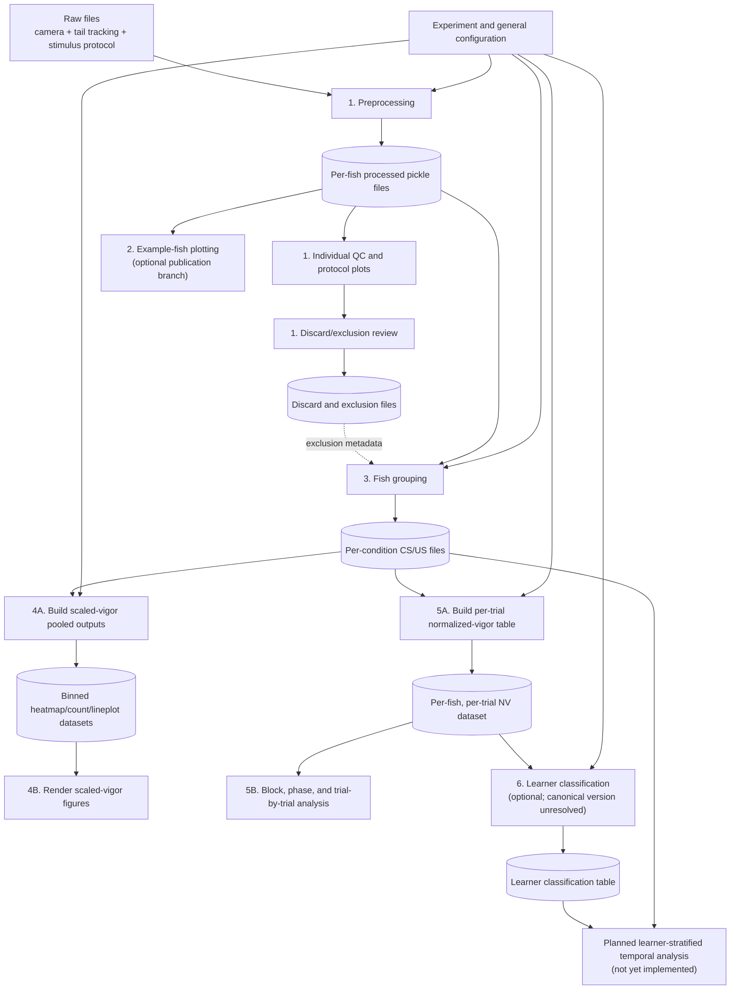

# Analysis Files Index and Execution Order

## Purpose

This document is a table of contents and dependency map for the analysis code in this repository.

It identifies:

- The intended order of analysis
- The input and output of each stage
- Optional branches
- Shared support modules
- Legacy and current implementations
- Multiple versions of the same analysis
- Important differences between overlapping implementations
- Areas where no canonical version has yet been established

This index describes the repository as it currently exists. It does not certify that every implementation is scientifically correct. See `ANALYSIS_ISSUES.md` for the analysis audit.

## Quick navigation

1. [Pipeline overview](#pipeline-overview)
2. [Recommended execution order](#recommended-execution-order)
3. [Numbered analysis scripts](#numbered-analysis-scripts)
4. [Shared support modules](#shared-support-modules)
5. [Legacy module family](#legacy-module-family)
6. [Overlapping implementations outside learner classification](#overlapping-implementations-outside-learner-classification)
7. [Learner-classification versions](#learner-classification-versions)
8. [Non-analysis repository files](#non-analysis-repository-files)
9. [Canonical-status summary](#canonical-status-summary)
10. [Recommended cleanup decisions](#recommended-cleanup-decisions)

## Pipeline overview



## Recommended execution order

The filename numbering is mostly meaningful, but the logical order within stage 1 and within stages 4 and 5 matters.

### Step 0: Select and validate configuration

Primary files:

- `experiment_configuration.py`
- `general_configuration.py`

Before running any analysis:

1. Select an `ExperimentType`.
2. Verify `path_home`.
3. Verify `path_save`.
4. Check condition names and colors.
5. Check trial counts and block definitions.
6. Check CS duration and conditioned-response window.
7. Check general frame rate, smoothing, bout, baseline, and trial-window settings.

### Step 1A: Preprocess raw data

Run:

```text
1_Preprocessing_IndividualFishPlotting_ProtocolPlotting_Discarding.py
```

with:

```python
RUN_PREPROCESS = True
```

Primary output:

```text
Processed data\pkl files\1. Original\<fish>.pkl
```

### Step 1B: Generate quality-control figures

In the same script, run as needed:

```python
RUN_PLOT_INDIVIDUALS = True
RUN_PLOT_PROTOCOLS = True
```

Review:

- Camera/frame integrity
- Tracking quality
- Individual fish heatmaps and traces
- Protocol timing
- CS/US alignment
- Baseline activity
- US responsiveness

### Step 1C: Apply discard criteria

After reviewing preprocessing and QC outputs, run:

```python
RUN_DISCARD = True
```

Expected metadata outputs include:

```text
Processed data\Fish to discard.txt
Processed data\Discarded_fish_IDs.txt
```

The discard step can also move processed and raw files. It should therefore be treated as a consequential data-management operation, not merely a plot.

### Step 2: Generate example-fish figures, if required

Run:

```text
2_ExampleFishPlotting.py
```

This is an optional publication-figure branch. It reads stage-1 per-fish pickle files but does not produce data required by stages 3-6.

### Step 3: Group fish by condition

Run:

```text
3_FishGrouping.py
```

Primary outputs:

```text
Processed data\pkl files\2. All fish by condition\<condition>_CS_new.pkl
Processed data\pkl files\2. All fish by condition\<condition>_US_new.pkl
```

This stage:

- Reads per-fish pickle files
- Splits CS- and US-aligned trials
- Sets out-of-bout vigor to missing
- Smooths and downsamples
- Recalculates scaled vigor
- Concatenates fish by condition

Important: the current script loads the discarded-fish list, but the list is not clearly applied to remove fish before concatenation. See `ANALYSIS_ISSUES.md`.

### Step 4A: Build scaled-vigor pooled artifacts

Run:

```text
4_ScaledVigorPlotting.py
```

with:

```python
RUN_BUILD_POOLED_OUTPUTS = True
```

Primary outputs include:

```text
Count heatmap <bin>s bins all fish_*.pkl
SV heatmap <bin>s bins all fish_*.pkl
SV lineplot <bin>s bins all fish_*.pkl
```

These are saved under:

```text
Processed data\pkl files\3. Pooled data\
```

### Step 4B: Render scaled-vigor figures

After pooled artifacts exist, enable the desired plot stages:

```python
RUN_COUNT_HEATMAP = True
RUN_SV_HEATMAP_RENDERING = True
RUN_SV_LINEPLOTS_INDIVIDUAL = True
RUN_SV_LINEPLOTS_CATCH_TRIALS = True
RUN_SV_LINEPLOTS_BLOCKS = True
```

Only enable stages needed for the intended output.

### Step 5A: Build normalized-vigor trial summaries

Run:

```text
5_NormalizedVigorPlotting.py
```

with:

```python
RUN_PROCESS = True
```

Primary output:

```text
NV per trial per fish_CR window ... .pkl
```

This stage reads the per-condition files from stage 3 and calculates:

- Mean baseline vigor
- Mean conditioned-response-window vigor
- Normalized vigor = response / baseline

### Step 5B: Run population summaries and statistics

In the same script, enable as required:

```python
RUN_BLOCK_SUMMARY_LINES = True
RUN_BLOCK_SUMMARY_BOXPLOT = True
RUN_PHASE_SUMMARY = True
RUN_TRIAL_BY_TRIAL = True
RUN_LME = True
```

This stage produces:

- Fish-level block summaries
- Boxplots and nonparametric comparisons
- Phase summaries
- Trial-by-trial trajectories
- Mixed-effects analyses

### Step 6: Run learner classification, if required

Inputs:

```text
NV per trial per fish_*.pkl
```

Potential scripts:

- `6_LearnersQuantification.py`
- `6_LearnersQuantification_new.py`
- `6_LearnersQuantification_improved.py`
- `6_LearnersQuantification_WIP.py`

These are not interchangeable. No repository-level declaration currently establishes one as canonical.

Select and freeze one implementation before generating labels or downstream learner/non-learner analyses.

### Step 7: Learner-stratified temporal analysis

Status:

```text
Planned, not implemented
```

Specification:

```text
Plans/LEARNER_STRATIFIED_VIGOR_ANALYSIS_PLAN.md
```

This future stage will join fish-level learner labels to CS/US time-series data and generate learner-, non-learner-, reference-, and unclassified-stratum analyses.

## Numbered analysis scripts

## 1. `1_Preprocessing_IndividualFishPlotting_ProtocolPlotting_Discarding.py`

### Role

Combined raw-data processing, quality control, protocol visualization, and exclusion workflow.

### Internal sub-stages

| Function | Role |
| --- | --- |
| `run_preprocess()` | Reads and synchronizes raw data, calculates behavior, identifies trials, and writes per-fish pickle files |
| `run_plot_individual_trials()` | Produces per-fish trial plots and heatmaps |
| `run_plot_protocols()` | Visualizes stimulus protocols from raw logs and processed data |
| `run_discard()` | Applies viability, US-response, baseline, and CR-window criteria and records/moves excluded fish |

### Inputs

- Camera timing files
- Tail-tracking files
- Stimulus-control files
- Experiment configuration
- General configuration

### Outputs

- Per-fish processed pickle files
- Camera/frame diagnostics
- Behavioral overviews
- Individual-fish plots
- Protocol plots
- Lost-frame and behavior summaries
- Discard/exclusion lists

### Dependencies

- `analysis_utils.py`
- `data_io.py`
- `figure_saving.py`
- `file_utils.py`
- `plotting_style.py`
- `experiment_configuration.py`
- `general_configuration.py`

### Canonical status

Current stage-1 entry point. No alternate current preprocessing script is present.

### Important note

Although this is one file, it combines four logically separate workflows. Run preprocessing first, review QC second, and apply discard criteria only after review.

## 2. `2_ExampleFishPlotting.py`

### Role

Publication-oriented plots for selected individual fish.

### Sub-stages

| Function | Role |
| --- | --- |
| `run_traces()` | Tail-angle and vigor traces for selected trials |
| `run_individual_trials()` | Individual trial heatmaps and normalized/scaled plots |
| `run_bout_zoom()` | Detailed bout view around a selected stimulus |
| `run_trajectory()` | Reconstructs and visualizes tail trajectories |

### Input

Per-fish pickle files from stage 1.

### Output

Standalone example-fish figures.

### Dependency status

Optional. Stages 3-6 do not depend on its outputs.

### Difference from stage-1 individual plotting

Stage 1 produces broad QC-oriented plots, often across many fish. Stage 2 targets selected fish and trials with publication-specific formatting and specialized views.

### Canonical status

Current publication example-fish entry point.

## 3. `3_FishGrouping.py`

### Role

Build CS- and US-aligned condition-level datasets from per-fish processed data.

### Main operations

- Load each fish
- Standardize metadata and dtypes
- Re-identify blocks when required
- Split CS versus US trials
- Set vigor outside bouts to missing
- Calculate baseline percentile scaling
- Apply rolling smoothing
- Downsample
- Concatenate fish by condition
- Save condition-level files

### Inputs

```text
Processed data\pkl files\1. Original\*.pkl
```

### Outputs

```text
Processed data\pkl files\2. All fish by condition\*_CS_new.pkl
Processed data\pkl files\2. All fish by condition\*_US_new.pkl
```

### Canonical status

Current grouping entry point.

### Important note

This is the first required stage after preprocessing. The output is consumed independently by both stage 4 and stage 5.

## 4. `4_ScaledVigorPlotting.py`

### Role

Build and render time-resolved scaled-vigor population artifacts.

### Internal order

| Order | Function | Role |
| --- | --- | --- |
| 4A | `run_build_pooled_outputs()` | Converts condition-level files into binned heatmap/count/lineplot artifacts |
| 4B | `run_count_heatmap()` | Renders contribution/count heatmaps |
| 4C | `run_sv_heatmap_rendering()` | Renders scaled-vigor heatmaps |
| 4D | `run_sv_lineplots_individual_catch_trials()` | Renders selected individual catch-trial profiles |
| 4E | `run_sv_lineplot_all_catch_trials()` | Renders pooled catch-trial profiles |
| 4F | `run_sv_lineplots_per_block()` | Renders block-level temporal profiles |

### Inputs

Condition-level CS/US files from stage 3.

### Intermediate outputs

- Count heatmap pickle
- Scaled-vigor heatmap pickle
- Scaled-vigor lineplot pickle

### Final outputs

- Count/coverage heatmaps
- Scaled-vigor heatmaps
- Catch-trial temporal profiles
- Block temporal profiles

### Canonical status

Current scaled-vigor population entry point.

### Important note

This file includes both data-building and rendering stages. A plot stage may load an existing pooled artifact rather than rebuild it, so input artifact selection must be verified.

## 5. `5_NormalizedVigorPlotting.py`

### Role

Calculate per-trial normalized vigor and perform population summaries and statistics.

### Internal order

| Order | Function | Role |
| --- | --- | --- |
| 5A | `run_data_aggregation()` | Calculates baseline, CR response, and normalized vigor per fish and trial |
| 5B | `run_block_summary_lines()` | Plots fish and condition block summaries |
| 5C | `run_block_summary_boxplot()` | Produces block boxplots and nonparametric comparisons |
| 5D | `run_phase_summary()` | Summarizes selected experimental phases |
| 5E | `run_trial_by_trial()` | Produces trial trajectories and mixed-effects analyses |

### Inputs

Condition-level CS/US files from stage 3.

### Intermediate output

Per-fish, per-trial normalized-vigor pickle.

### Final outputs

- Block line summaries
- Block boxplots
- Phase summaries
- Trial-by-trial plots
- Statistical annotations and model output
- Optional exported trial table

### Canonical status

Current normalized-vigor population entry point.

### Important note

The learner-classification scripts consume this stage's per-trial normalized-vigor output.

## 6. Learner-classification scripts

### Shared role

All four scripts:

1. Load the per-trial normalized-vigor dataset.
2. Reorganize trials into five-trial blocks.
3. Extract acquisition and recovery/extinction features.
4. Fit mixed-effects models to estimate fish-specific effects.
5. Compare fish with the reference/control distribution.
6. Classify learners.
7. Produce diagnostic and individual-fish plots.
8. Optionally export a fish-level classification CSV.

### Canonical status

Unresolved.

Do not treat the filename without a suffix as proof that it generated manuscript results. Do not treat `new`, `improved`, or `WIP` as proof of scientific superiority. The classifier must be selected based on a documented statistical decision and then frozen.

Detailed differences are documented in [Learner-classification versions](#learner-classification-versions).

## Shared support modules

## `experiment_configuration.py`

### Role

Current experiment-specific configuration system.

### Main objects

- `ExperimentConfig`
- `ExperimentType`
- `get_experiment_config()`

### Provides

- Raw and output paths
- Conditions
- Display names and colors
- Trial counts
- CS duration
- Conditioned-response window
- Five-/ten-trial and phase block definitions

### Current consumers

All numbered scripts.

### Version relationship

Modern replacement for the global, match-case configuration in
`legacy/modules/my_experiment_specific_variables.py`.

### Caution

Both files enumerate the same 38 experiment identifiers, but equal coverage does not guarantee equal parameter values or completeness. Some modern entries contain simplified or placeholder logic.

## `general_configuration.py`

### Role

Current shared analysis defaults.

### Provides

- Validation settings
- Filtering windows
- Bout-detection settings
- Expected frame rate
- Trial windows
- Baseline window
- Binning windows
- Shared labels and colors

### Current consumers

- Numbered scripts 1-5
- `analysis_utils.py`
- `data_io.py`

### Version relationship

Modern dataclass-based replacement for
`legacy/modules/my_general_variables.py`.

## `analysis_utils.py`

### Role

Current shared analytical utility module.

### Major groups

- Frame-rate and tracking validation
- Interpolation and filtering
- Vigor and bout detection
- Stimulus annotation
- Trial and block identification
- Time conversion
- Tail-coordinate and heatmap helpers
- Figure text/annotation positioning

### Version relationship

Contains refactored analysis portions of the old
`legacy/modules/my_functions.py`.

## `data_io.py`

### Role

Current file-reading and timing-map module.

### Provides

- Camera-log reading
- Sync-reader reading
- Protocol reading
- Absolute-to-elapsed time mapping
- Tail-tracking reading

### Version relationship

Contains I/O functions extracted from `legacy/modules/my_functions.py`.

## `file_utils.py`

### Role

Current filesystem, output-directory, fish-ID, and exclusion-list utility module.

### Provides

- Standard output-folder creation
- Text logging
- Fish-ID parsing
- Discarded/excluded fish-list loading

### Version relationship

Contains filesystem and ID functions extracted from
`legacy/modules/my_functions.py`, plus newer discard-list helpers.

## `figure_saving.py`

### Role

Current centralized figure-export helper.

### Provides

- Windows-safe filenames
- Format/suffix enforcement
- Parent-folder creation
- Shared save behavior

### Version relationship

Newer dedicated module. The old `legacy/modules/my_functions.py` did not
provide an equivalent centralized export API.

### Caution

Some analysis scripts still define local wrappers or call `fig.savefig()` directly, so saving behavior is not yet fully centralized.

## `plotting_style.py`

### Role

Current shared Matplotlib/Seaborn style configuration.

### Provides

- `PlotStyleConfig`
- Shared `rcParams`
- Axis formatting
- Trace-axis formatting
- Shared heatmap, lineplot, legend, and save constants

### Version relationship

Replaces the `set_plot_style()` implementation in
`legacy/modules/my_functions.py` and scattered plot constants.

### Caution

The opening docstring calls this a facade for `plotting_style_new`, but no such file is present; the full implementation is embedded in this file. Treat `plotting_style.py` itself as the current implementation.

## Legacy module family

The numbered scripts no longer import these modules directly, except that the legacy experiment module imports the legacy helper module.

## `legacy/modules/my_general_variables.py`

### Role

Legacy module-level general configuration.

### Status

Legacy compatibility/reference file.

### Replaced by

```text
general_configuration.py
```

### Difference

The legacy file exposes global variables directly. The current file groups settings into dataclasses and derives labels/windows in `GeneralConfig`.

## `legacy/modules/my_experiment_specific_variables.py`

### Role

Legacy experiment-selection and experiment-specific configuration.

### Implementation

- One global `experiment_` string
- A very large `match experiment_` block
- Module-level variables for paths, conditions, trials, and phases

### Status

Legacy compatibility/reference file.

### Replaced by

```text
experiment_configuration.py
```

### Difference

The current implementation uses:

- `ExperimentType`
- `ExperimentConfig`
- `get_experiment_config()`

This makes configuration selection explicit and avoids importing a module whose behavior depends on one editable global string.

### Caution

The legacy and current files currently enumerate the same experiment names, but their values should not be mixed within one run.

## `legacy/modules/my_functions.py`

### Role

Legacy monolithic helper library.

### Historical responsibilities

- Plot styling
- Folder creation
- Fish-ID parsing
- Camera and protocol I/O
- Tracking I/O
- Synchronization
- Filtering
- Vigor and bout detection
- Trial/block assignment
- Data preparation
- Plotting

### Status

Legacy compatibility/reference file.

### Replaced by

| Legacy responsibility | Current module |
| --- | --- |
| General configuration | `general_configuration.py` |
| Experiment configuration | `experiment_configuration.py` |
| File I/O | `data_io.py` |
| Analysis helpers | `analysis_utils.py` |
| Paths and fish IDs | `file_utils.py` |
| Plot style | `plotting_style.py` |
| Figure export | `figure_saving.py` |

### Important difference

The current modules are not guaranteed to be behaviorally identical to the legacy functions. Several were refactored or simplified. The legacy file should not be used as a silent fallback.

## Overlapping implementations outside learner classification

## A. Individual-fish plotting

### Stage-1 version

File:

```text
1_Preprocessing_IndividualFishPlotting_ProtocolPlotting_Discarding.py
```

Purpose:

- Quality control
- Broad per-fish review
- Raw/scaled/normalized heatmaps
- Support for discard decisions

### Stage-2 version

File:

```text
2_ExampleFishPlotting.py
```

Purpose:

- Selected publication examples
- Carefully chosen trials
- Bout zoom
- Tail trajectories
- Publication-specific layout

### Difference

Stage 1 is QC-oriented and closely coupled to preprocessing/discarding. Stage 2 is a publication branch for selected fish and contains specialized views.

### Recommendation

Keep both conceptual roles, but extract shared renderers so the same metric is not drawn differently in QC and publication figures without an explicit reason.

## B. Scaled-vigor calculation and normalization

Scaled vigor is calculated or transformed in multiple places.

### Version 1: Stage-1 per-fish scaled vigor

File:

```text
1_Preprocessing_IndividualFishPlotting_ProtocolPlotting_Discarding.py
```

Behavior:

- Per trial
- Uses baseline vigor from times earlier than `-baseline_window`
- Uses baseline 10th and 90th percentiles
- Applies min-max scaling

### Version 2: Stage-3 grouped scaled vigor

File:

```text
3_FishGrouping.py
```

Behavior:

- Sets out-of-bout vigor to missing
- Recalculates 10th/90th-percentile baseline statistics
- Applies min-max scaling
- Smooths and downsamples

### Version 3: Stage-4 heatmap re-normalization

File:

```text
4_ScaledVigorPlotting.py
```

Behavior:

- Aggregates scaled vigor
- Bins in time
- Computes new pre-stimulus 10th/90th percentiles
- Re-normalizes and clips heatmap values to `[0, 1]`

### Version 4: Stage-4 lineplot baseline subtraction

File:

```text
4_ScaledVigorPlotting.py
```

Behavior:

- Optionally subtracts the median in the immediate pre-stimulus interval
- Clips to a configured display range

### Difference

These are not one single scaling step. A stage-4 figure can contain data transformed at stage 1 or 3 and then transformed again for display.

### Recommendation

Name each transformation explicitly:

- Analytical scaled vigor
- Heatmap display normalization
- Lineplot baseline centering
- Display clipping

Do not call all of them simply “scaled vigor.”

## C. Normalized-vigor calculation

### Stage-1 individual-plot version

File:

```text
1_Preprocessing_IndividualFishPlotting_ProtocolPlotting_Discarding.py
```

Purpose:

- Per-fish QC visualization

### Stage-5 population version

File:

```text
5_NormalizedVigorPlotting.py
```

Purpose:

- Creates the canonical pooled per-trial table used for population statistics and learner classification

### Difference

Stage 1 calculates/plots the measure locally for visual inspection. Stage 5 creates the saved population analysis artifact.

### Recommendation

Treat the stage-5 saved table as the current downstream source, but consolidate both calculations into one tested shared function.

## D. Fish exclusion handling

### Stage 1

Writes:

```text
Fish to discard.txt
Discarded_fish_IDs.txt
```

It can also move processed and raw files.

### Stage 3

Loads the discard list and uses it for included/discarded heatmap grids, but does not clearly remove discarded fish before creating condition-level files.

### Stage 4

Can remove discarded fish while building or plotting scaled-vigor outputs:

```python
APPLY_FISH_DISCARD = True
```

### Stage 5

Can remove discarded fish while aggregating normalized vigor:

```python
APPLY_FISH_DISCARD = False
```

by current default.

### Learner scripts

Only the WIP learner script contains explicit selected-fish suffix and discard-aware input/output controls.

### Difference

The same exclusion list is not applied at one authoritative boundary. Different outputs can therefore use different cohorts.

### Recommendation

Create one immutable cohort manifest and join it into every downstream dataset.

## E. Block assignment

Block definitions originate in:

```text
experiment_configuration.py
```

but blocks may be recalculated or renamed in:

- `analysis_utils.identify_blocks_trials()`
- `3_FishGrouping.py`
- `5_NormalizedVigorPlotting.py`
- All learner-classification scripts

Learner scripts additionally create five-trial block names that may differ from the ten-trial names in the experiment configuration.

### Recommendation

Centralize trial-to-block mappings and export a table showing:

```text
trial number -> trial type -> 5-trial block -> 10-trial block -> phase
```

## F. Figure saving

Current patterns include:

- `figure_saving.save_figure()`
- Script-local `save_fig()` wrappers
- Script-local `save_figure()` wrappers
- Direct `fig.savefig()`

### Difference

Filename sanitization, selected-fish suffixes, DPI, bounding boxes, transparency, and format handling can differ by script.

### Recommendation

Complete the migration to `figure_saving.py`, following
`Plans/12_FIGURES_CLI_AND_NOTEBOOKS.md` (detail archived in
`Plans/Archive/SCIENTIFIC_FIGURE_PIPELINE_PLAN.md`).

## Learner-classification versions

## Shared scientific objective

All four files attempt to identify individual learners from trial-level normalized-vigor data using:

- Acquisition-like suppression features
- Recovery/extinction-like features
- Mixed-effects estimates and BLUPs
- A control/reference distribution
- Multivariate classification

They differ materially in response variable, transformations, reference estimation, decision statistic, threshold, voting rule, and exported columns.

## Version 1: `6_LearnersQuantification.py`

### Classification model

- Extracts acquisition and recovery features using mixed-effects models.
- Models log response with log baseline adjustment.
- Uses `log(x + 1)`.
- Computes robust Mahalanobis distance from controls.
- Uses a bootstrap percentile distance threshold.
- Uses point and conservative directional votes.
- Conservative voting requires the uncertainty-adjusted estimate to pass the control mean.

### Effective defaults

- Features: acquisition and extinction/recovery
- Distance percentile: 50th
- Bootstrap iterations: 100
- Point voting threshold: configured as 3 but reduced to number of selected features
- Conservative voting threshold: configured as 3 but reduced to number of selected features
- Conservative SE multiplier: 1.96
- Result export disabled by default

### Export labels

- `Is_Learner_Point`
- `Is_Learner_Conservative`

### Strength

Most complete “original” implementation, with diagnostics, summaries, and extensive plotting.

### Limitation

The conservative rule can penalize uncertain fish twice: mixed-model shrinkage plus a separate CI requirement.

### Status

Candidate historical/baseline implementation. Not proven to be the manuscript-generating canonical version.

## Version 2: `6_LearnersQuantification_new.py`

### Stated purpose

Replaces conservative CI voting with a probability-of-learning calculation to avoid the double-penalization problem.

### Classification model

- Retains point classification.
- Replaces conservative votes with probabilistic votes.
- Calculates per-feature `P_learn` from BLUP and SE.
- Retains Mahalanobis distance outlier detection.
- Supports bootstrap or theoretical chi-square thresholds.

### Effective top-level defaults

- Point voting threshold: 2
- Probabilistic voting threshold: 2
- Probability threshold: 0.60
- Distance percentile: 75th
- Theoretical threshold disabled
- Bootstrap iterations: 50
- Result export enabled

### Export labels

- Point learner
- Probabilistic learner
- Per-feature learning probability

### Strength

Explicitly addresses the inflexible conservative-CI rule.

### Limitations

- The probability threshold requires scientific justification.
- Comments and dataclass defaults do not always match active top-level values.
- Broad warning suppression can hide model problems.

### Status

Alternative probabilistic branch. Incompatible with version 1 learner labels.

## Version 3: `6_LearnersQuantification_improved.py`

### Stated purpose

Standalone redesign that does not import the `new` script.

### Feature model

- Models log absolute CR vigor.
- Adjusts for log baseline vigor.
- Uses direct `log(x)`, requiring positive values.
- Uses control-anchored mixed-effects features.

### Classification model

- Converts features into directional z-scores.
- Sets wrong-direction components to zero for the joint score.
- Uses a whitened quadratic statistic:

```text
T = z_positive^T covariance_inverse z_positive
```

- Uses leave-one-out reference means for control fish.
- Estimates control covariance using shrinkage.
- Calibrates the threshold empirically on controls.
- Requires all selected features to point in the learning direction.

### Active defaults

- Target control false-positive rate: 0.10
- Per-fish SE used in directional scoring
- Result export enabled

### Export labels

- One primary `is_learner` classification
- Directional z-scores
- Joint T statistic
- Empirical p-value

### Strength

More explicit control false-positive calibration and a unified directional joint statistic.

### Limitation

A 10% target false-positive rate may be too permissive for the intended use and must be justified.

### Status

Algorithmically redesigned candidate. Not compatible with versions 1 or 2.

## Version 4: `6_LearnersQuantification_WIP.py`

### Lineage

Closely related to the improved version, with additional input, cohort, transformation, and naming controls.

### Key changes from `improved`

- Adds `APPLY_FISH_DISCARD`.
- Adds selected-fish filename suffix handling.
- Adds explicit pooled-data path override.
- Adds selection among filtered, unfiltered, or automatic pooled inputs.
- Adds `USE_LOG_TRANSFORM`.
- Models normalized vigor directly:
  - `log(Normalized vigor) ~ Epoch`, or
  - `Normalized vigor ~ Epoch`
- Changes target control false-positive rate from 0.10 to 0.05.
- Adds WIP-specific output naming in parts of the pipeline.

### Active defaults

- Target control false-positive rate: 0.05
- Per-fish SE used in scoring
- Log transform enabled
- Fish discard disabled
- Non-NaN-filtered pooled input requested
- Result export enabled

### Strength

Most explicit controls for input artifact choice, cohort suffix, and response transformation.

### Limitations

- It is explicitly marked WIP.
- Additional switches increase configuration risk.
- Its response model differs from the improved version, so its feature values are not directly comparable.

### Status

Experimental successor/branch of `improved`; not established as canonical.

## Learner-version comparison table

| Property | Original | New | Improved | WIP |
| --- | --- | --- | --- | --- |
| Primary file | `6_LearnersQuantification.py` | `6_LearnersQuantification_new.py` | `6_LearnersQuantification_improved.py` | `6_LearnersQuantification_WIP.py` |
| Response model | `log(CR + 1)` adjusted for `log(baseline + 1)` | Same general family as original | `log(CR)` adjusted for `log(baseline)` | `log(normalized vigor)` or raw normalized vigor |
| Feature estimator | Control-anchored LME/BLUP | Control-anchored LME/BLUP | Control-anchored LME/BLUP | Control-anchored LME/BLUP |
| Distance/joint score | Mahalanobis distance | Mahalanobis distance | Directional whitened T | Directional whitened T |
| Direction rule | Point and CI-conservative votes | Point and probability votes | All features in expected direction | All features in expected direction |
| Threshold | Bootstrap percentile | Bootstrap percentile or theoretical chi-square | Empirical control quantile | Empirical control quantile |
| Reference handling | Control group | Control group | Leave-one-out control reference | Leave-one-out control reference |
| Active threshold level | 50th percentile | 75th percentile | Target FPR 0.10 | Target FPR 0.05 |
| Main label | Point/conservative | Point/probabilistic | `is_learner` | `is_learner` |
| Cohort suffix support | No | No | No | Yes |
| Explicit input artifact override | No | Limited auto-discovery | Limited auto-discovery | Yes |
| Declared status | Baseline/original | Probabilistic version | Improved standalone | Work in progress |

## Why learner outputs cannot be mixed

### Critical incompatibilities

1. **Different response variables**
   - Absolute response adjusted for baseline versus normalized-vigor ratio.

2. **Different transforms**
   - `log(x + 1)` versus `log(x)`.

3. **Different classification statistics**
   - Mahalanobis distance plus voting versus directional whitened T.

4. **Different threshold calibration**
   - 50th/75th percentiles versus target 10%/5% control false-positive rates.

5. **Different learner definitions**
   - Point
   - Conservative CI
   - Probability of learning
   - Joint directional empirical classifier

6. **Different output schemas**
   - `Is_Learner_Conservative`
   - `Is_Learner_Probabilistic`
   - `is_learner`

7. **Filename collision risk**
   - Multiple versions can write similarly named classification CSV files.

### Rule

If the selected classifier changes, rerun classification for all fish and regenerate every downstream learner-stratified table and figure.

Do not combine labels from different versions in one dataset.

## Canonical decision required

Before implementing `Plans/LEARNER_STRATIFIED_VIGOR_ANALYSIS_PLAN.md`, record:

```text
Canonical classifier file
Git commit
Configuration values
Input artifact
Cohort manifest
Feature definitions
Response transformation
Reference definition
Threshold calibration
Primary learner label
Random seed
Output schema
```

The decision should be based on statistical validation, not filename.

## Non-analysis repository files

## Documentation

| File | Role |
| --- | --- |
| `README.md` | Project overview, setup, pipeline, and output structure |
| `ANALYSIS_ISSUES.md` | Audit of scientific and statistical issues |
| `IMAGING_PIPELINE_CRITIQUE.md` | Cross-repository audit of the inherited optional imaging workflow |
| `Plans/BEHAVIOR_IMAGING_INTEGRATION_PLAN.md` | Deferred plan for one canonical behavior pipeline plus optional imaging |
| `Plans/12_FIGURES_CLI_AND_NOTEBOOKS.md` | Plan for reproducible scientific-paper figures (archived detail under `Plans/Archive/SCIENTIFIC_FIGURE_PIPELINE_PLAN.md`) |
| `Plans/LEARNER_STRATIFIED_VIGOR_ANALYSIS_PLAN.md` | Plan for labeling and analyzing learner/non-learner temporal profiles |
| `ANALYSIS_FILES_INDEX.md` | This file |

## Workspace and editor files

| File | Role |
| --- | --- |
| `ClassicalConditioning.code-workspace` | VS Code workspace definition |
| `.vscode\settings.json` | Workspace editor settings |

## Other artifacts

| File | Role |
| --- | --- |
| `.gitignore` | Git ignore rules |

## Canonical-status summary

| Area | Current preferred/current file | Alternate/legacy files | Status |
| --- | --- | --- | --- |
| General configuration | `general_configuration.py` | `legacy/modules/my_general_variables.py` | Legacy source archived and blocked from active imports |
| Experiment configuration | `experiment_configuration.py` | `legacy/modules/my_experiment_specific_variables.py` | Legacy source archived; values still need validation |
| Shared analysis helpers | `analysis_utils.py` | Portions of `legacy/modules/my_functions.py` | Legacy source archived; behavior is not guaranteed identical |
| Data I/O | `data_io.py` | Portions of `legacy/modules/my_functions.py` | Legacy source archived |
| File/path helpers | `file_utils.py` | Portions of `legacy/modules/my_functions.py` | Legacy source archived |
| Figure saving | `figure_saving.py` | Local wrappers/direct `savefig` | Migration incomplete |
| Plot style | `plotting_style.py` | `legacy/modules/my_functions.set_plot_style()` | Legacy source archived |
| Preprocessing | Stage-1 script | No current alternate | Current entry point |
| Example fish | Stage-2 script | Stage-1 QC plots overlap | Different purposes |
| Fish grouping | Stage-3 script | No current alternate | Current entry point |
| Scaled vigor | Stages 1, 3, and 4 all transform it | Multiple overlapping transformations | Canonical mathematical definition required |
| Normalized vigor | Stage-5 saved table | Stage-1 local visualization | Stage 5 is current downstream source |
| Exclusions | Stage-1 list | Applied inconsistently later | Canonical cohort boundary required |
| Learner classification | None selected | Four incompatible versions | Canonical version unresolved |
| Learner-stratified analysis | Not implemented | Plan document only | Future work |

## Recommended cleanup decisions

### 1. Select the learner classifier

Highest-priority version decision.

Do not proceed to learner/non-learner temporal profiles until one classifier and one output schema are frozen.

### 2. Define canonical vigor transformations

Create tested shared functions for:

- Raw vigor
- Conditional bout vigor
- Analytical scaled vigor
- Heatmap-only normalization
- Lineplot baseline centering
- Normalized vigor

### 3. Create one cohort manifest

Replace stage-specific discard switches with one fish-level inclusion table joined into every output.

### 4. Centralize trial/block mapping

Create one versioned mapping for every experiment:

```text
trial -> alignment -> 5-trial block -> 10-trial block -> phase -> catch status
```

### 5. Archive legacy modules explicitly

After validating that no active workflow imports them:

- Move legacy modules to a clearly named `legacy/` folder, or
- Add deprecation headers and tests preventing new imports.

Do not delete them until important historical experiments have been checked against the modern configuration.

### 6. Split build and render stages

Stages 4 and 5 mix artifact creation with plotting/statistics. Separate:

- Data preparation
- Statistical analysis
- Panel rendering
- Figure export

### 7. Remove ambiguous artifact discovery

Replace “first matching” or “latest matching” file selection with explicit input paths and run identifiers.

### 8. Record pipeline provenance

Every saved artifact should identify:

- Source data
- Code commit
- Experiment
- Cohort
- Configuration
- Upstream artifact
- Generation timestamp

## Final working rule

For the current repository, the practical analysis order is:

```text
configure
  -> preprocess
  -> inspect QC and protocols
  -> decide exclusions
  -> optionally generate example-fish figures
  -> group fish by condition
  -> build and plot scaled-vigor outputs
  -> build normalized-vigor trial table
  -> run population summaries/statistics
  -> optionally run one explicitly selected learner classifier
  -> later run learner-stratified temporal analysis
```

The filename numbering documents this broad order, but it does not resolve overlapping transformations or the learner-classifier version. Those decisions must be made explicitly and recorded.
