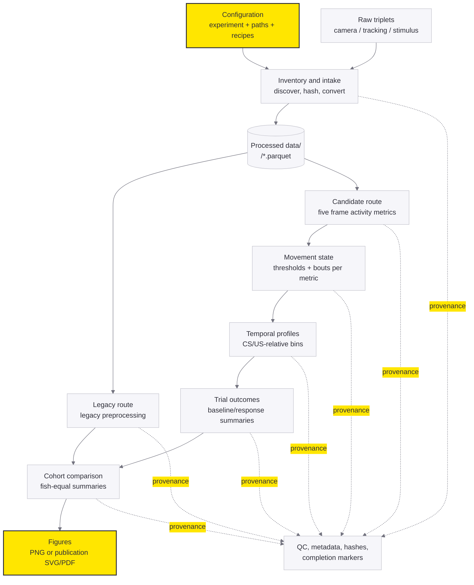

# Analysis Pipeline and Heatmap Audit

This document is an executable-code map for the Classical Conditioning analysis.
It answers two questions:

1. In what order are raw data transformed into analysis tables and figures?
2. What does each row of the five-row candidate heatmap represent?

The repository currently contains two routes. The numbered root scripts are the
historical route. The installable package under `src/classical_conditioning` is
the supported route for new analysis.

## 1. Ordered pipeline



### Supported package route

The normal entry point is:

```powershell
uv run classical-conditioning run-pipeline --config configs\example-run.json
```

The orchestration is implemented in [pipeline.py](../../src/classical_conditioning/pipeline.py):

| Order | Operation | Code | Main outputs |
| --- | --- | --- | --- |
| 0 | Validate run configuration and select recordings | [run_config.py](../../src/classical_conditioning/run_config.py), [pipeline.py](../../src/classical_conditioning/pipeline.py) | selected recording IDs |
| 1 | Optional inventory of raw triplets and SHA-256 hashes | [inventory.py](../../src/classical_conditioning/inventory.py) | `Metadata/recording_inventory.json` |
| 2 | Intake immutable camera, tracking, and protocol files | [intake.py](../../src/classical_conditioning/intake.py), [readers.py](../../src/classical_conditioning/ingestion/readers.py) | `Processed data/<recording-id>/camera.parquet`, `tracking.parquet`, `stimulus_events.parquet` |
| 3A | Legacy preprocessing, if route `legacy` is enabled | [legacy_v1.py](../../src/classical_conditioning/preprocessing/legacy_v1.py) | `frame_preprocessed_legacy-v1.parquet` plus QC/metadata |
| 3B | Candidate frame metrics, if route `candidate` is enabled | [candidates_v1.py](../../src/classical_conditioning/preprocessing/candidates_v1.py) | `frame_activity_candidates-v1.parquet` |
| 4 | Calibrate movement and detect bouts independently for each candidate metric | [movement_state.py](../../src/classical_conditioning/analysis/movement_state.py) | `movement_state_candidates-v1.parquet` |
| 5 | Align each CS/US event and aggregate into 0.5 s temporal bins | [temporal_profiles.py](../../src/classical_conditioning/analysis/temporal_profiles.py) | `candidate_temporal_outcomes-v2.parquet` |
| 6 | Produce trial-level outcomes and coverage | [trial_outcomes.py](../../src/classical_conditioning/analysis/trial_outcomes.py) | candidate trial outcome and coverage Parquet files |
| 7 | Combine recordings and compare all five metrics | [metric_comparison.py](../../src/classical_conditioning/analysis/metric_comparison.py) | `Processed data/Analyses/<analysis-id>/...recording_summary.parquet`, `...cohort_summary.parquet` |
| 8 | Render figures from immutable saved tables | [figures/temporal_profiles.py](../../src/classical_conditioning/figures/temporal_profiles.py), [figures/metric_comparison.py](../../src/classical_conditioning/figures/metric_comparison.py) | `Figures/PNG/...` or `Figures/Publication/...` plus `.figure.json` |
| 9 | Write run-level audit record | [pipeline.py](../../src/classical_conditioning/pipeline.py) | `Metadata/<analysis-id>_pipeline_run.json` |

For the candidate route, the per-recording order is enforced by
[candidate_runner.py](../../src/classical_conditioning/analysis/candidate_runner.py):

```text
candidate frame metrics
  -> movement state and bouts
  -> temporal profiles
  -> trial outcomes
  -> five-metric cohort comparison
  -> optional figures
```

The runner verifies hashes and completion markers between stages. The two
candidate route families are paired by recipe in
[movement_state.py](../../src/classical_conditioning/analysis/movement_state.py):
the development route uses `tail-candidate-development-v1`; the corrected route
uses `tail-candidate-corrected-v1` and corrected preprocessing.

### Historical numbered-script route

This route is retained for reproduction and is controlled by in-script `RUN_*`
flags:

| Order | Script | What it does | Main output area |
| --- | --- | --- | --- |
| 1 | [1_Preprocessing_IndividualFishPlotting_ProtocolPlotting_Discarding.py](../../1_Preprocessing_IndividualFishPlotting_ProtocolPlotting_Discarding.py) | raw synchronization, legacy vigor, bout detection, individual QC, protocol plots, discard review | `Processed data/pkl files/1. Original`, individual/QC figure folders, discard lists |
| 2 | [2_ExampleFishPlotting.py](../../2_ExampleFishPlotting.py) | optional selected-fish traces, heatmaps, trajectories | individual-fish figure folders |
| 3 | [3_FishGrouping.py](../../3_FishGrouping.py) | concatenate fish by condition and alignment | `Processed data/pkl files/2. All fish by condition` |
| 4 | [4_ScaledVigorPlotting.py](../../4_ScaledVigorPlotting.py) | pool, bin, normalize, and render count/SV heatmaps and lineplots | `Processed data/pkl files/3. Pooled data`, pooled figure folders |
| 5 | [5_NormalizedVigorPlotting.py](../../5_NormalizedVigorPlotting.py) | trial/block normalized-vigor summaries and statistics | pooled normalized-vigor figure/statistic folders |
| 6 | [6_LearnersQuantification.py](../../6_LearnersQuantification.py) and variants | learner classification and diagnostics | learner output folders |

The detailed historical execution notes are in
[ANALYSIS_FILES_INDEX.md](ANALYSIS_FILES_INDEX.md). The learner scripts are
different implementations, not interchangeable stages; no one is currently
declared canonical.

## 2. What the five-row candidate heatmap represents

### The short answer

It is a **matrix of one outcome measured using five alternative definitions of
activity**. The large title names the outcome. The five subplot titles name the
activity metric used to define the movement detector and to report the outcome.

For example, a figure titled **movement probability** means:

> For every row, estimate the fraction of detector-valid samples classified as
> moving, but run that detector separately on each of the five candidate
> activity signals.

It does **not** mean that the first row is movement probability, the second row
is XY RMS, and so on. All five rows contain the same selected outcome column,
but each row uses a different `Metric ID` slice.

### The five rows

The row labels are defined in `METRIC_LABELS` in
[figures/temporal_profiles.py](../../src/classical_conditioning/figures/temporal_profiles.py):

| Row | Internal metric ID | Signal and units | What “moving” means for this row |
| --- | --- | --- | --- |
| A | `segment_absolute_angular_speed_sum` | Sum of absolute segment angular speeds, `rad/ms` | The candidate's angular-speed signal exceeds its calibrated thresholds |
| B | `all_segment_angular_rms` | Length-weighted RMS angular speed across tail segments, `rad/ms` | The candidate's angular-RMS signal exceeds its thresholds |
| C | `whole_tail_xy_rms_speed` | Length-weighted RMS 2-D tail-point speed, `px/ms` | The candidate's whole-tail XY RMS signal exceeds its thresholds |
| D | `whole_tail_xy_mean_speed` | Length-weighted mean 2-D tail-point speed, `px/ms` | The candidate's whole-tail XY mean signal exceeds its thresholds |
| E | `curvature_change_rms` | Length-weighted RMS curvature-change rate, `rad/px/ms` | The candidate's curvature-change signal exceeds its thresholds |

The frame-level formulas are computed in
[preprocessing/candidates_v1.py](../../src/classical_conditioning/preprocessing/candidates_v1.py).
The five signals are intentionally exploratory and are carried through the
same downstream pipeline so their behavior can be compared. The repository
decision is explicitly **not** to choose one metric before that comparison;
see [DECISIONS.md](../../Plans/DECISIONS.md).

## 3. What the large title means

The outcome dictionary is defined as `OUTCOME_SPECS` in
[figures/temporal_profiles.py](../../src/classical_conditioning/figures/temporal_profiles.py).
It maps the command-line `--outcome` to the exact column plotted:

| Command outcome | Figure title | Data column in each row | Interpretation |
| --- | --- | --- | --- |
| `total-activity` | `total activity` | `Total activity mean` | Mean candidate signal in the time bin, after the candidate-specific signal is selected |
| `movement-probability` | `movement probability` | `Movement probability` | `moving valid samples / detector-valid samples` |
| `fraction-time-moving` | `fraction time moving` | `Fraction time moving` | moving time / detector-valid time, using measured `DeltaTimeMs` |
| `conditional-intensity` | `conditional movement intensity` | `Conditional intensity mean` | Mean candidate signal only while the detector calls the sample moving |
| `bout-rate` | `bout initiation rate` | `Bout rate per minute` | detected bout onsets per minute of detector-valid time |

The calculation of these columns is in
[analysis/temporal_profiles.py](../../src/classical_conditioning/analysis/temporal_profiles.py).
For each trial and each metric it creates one record per time bin. Thus the
basic data key is:

```text
(Trial type, Trial number, Time bin, Metric ID) -> outcome columns
```

The value displayed in a heatmap cell is therefore:

```text
profiles
  -> select Trial type
  -> select one Metric ID for the row
  -> select one outcome column for the figure
  -> pivot Trial number x Time bin
  -> imshow the resulting matrix
```

## 4. Exact figure construction

The five-row rendering is `_candidate_heatmap_figure()` in
[figures/temporal_profiles.py](../../src/classical_conditioning/figures/temporal_profiles.py).
Its controlling steps are:

1. `metrics = list(METRIC_LABELS)` fixes the five row order.
2. `selected = profiles[profiles["Trial type"] == trial_type]` selects CS or US.
3. The loop selects one `Metric ID` for each row.
4. `metric[outcome["coverage"]] < 0.9` masks cells with insufficient coverage.
5. `pivot(index="Trial number", columns="Time bin center (s)", values=outcome["column"])` creates the 2-D heatmap matrix.
6. `axis.imshow(...)` draws that matrix.
7. `axis.set_title(METRIC_LABELS[metric_id], loc="left")` writes the row title.
8. `figure.suptitle(... outcome['title'])` writes the large outcome title.
9. The colorbar label comes from `outcome["colorbar"]`.

This is why the labels look mixed: they are two different dimensions of the
same figure. The design is technically coherent, but the title does not state
the full two-dimensional meaning. A reader can reasonably interpret the row
labels as different plotted quantities, especially for `bout-rate` and
`movement-probability`.

### Coverage and color scales

For `movement-probability` and `fraction-time-moving`, the color scale is fixed
to `[0, 1]`. A cell of 0.8 means 80% under the relevant definition, not 80% of
the raw XY displacement or angular speed.

For `total-activity`, `conditional-intensity`, and `bout-rate`, the displayed
scale uses a panel 99th percentile rather than a universal physical scale.
Those figures are suitable for within-panel patterns, but color values should
not be compared across panels or runs without reading the recorded scale.

The renderer records the mapping in the figure sidecar (`.figure.json`),
including `value_field`, `coverage_field`, threshold, display scale, and color
map. The export implementation is
[figures/export.py](../../src/classical_conditioning/figures/export.py).

## 5. Do not confuse these with legacy heatmaps

The historical `4_ScaledVigorPlotting.py` produces a different kind of figure.
Its `run_build_pooled_outputs()` function writes:

```text
Processed data/pkl files/3. Pooled data/
  Count heatmap <bin>s bins all fish_*.pkl
  SV heatmap <bin>s bins all fish_*.pkl
  SV lineplot <bin>s bins all fish_*.pkl
```

`run_count_heatmap()` renders the **fraction of retained fish contributing a
non-missing vigor value** at each trial/time bin. It is titled “Percentage all
fish” in the legacy renderer; it is not the current candidate movement
probability outcome.

`run_sv_heatmap_rendering()` renders `SV heatmap` values. Those values are
legacy scaled-vigor values, not movement probability, bout rate, or any of the
five candidate metric rows. The legacy heatmap normalization is made in
`run_build_pooled_outputs()` and reproduced in
[analysis/legacy_scaled_vigor.py](../../src/classical_conditioning/analysis/legacy_scaled_vigor.py):

```text
exact-time median scaled vigor
  -> time-bin mean
  -> per-trial pre-zero P10/P90 transform
  -> clip to [0, 1]
  -> heatmap
```

The stacked rows in that legacy figure are experimental blocks/phases, not the
five candidate metrics. The current candidate figure instead has five metric
rows and uses the large title to select the outcome column.

## 6. Scientific interpretation and current caveats

The current candidate route is exploratory. It is designed to answer:

> Does the conditioning pattern remain similar when activity is represented by
> each of five plausible tail-motion metrics and summarized by complementary
> outcomes?

It is not yet a final claim that any one metric is the biological ground truth.
The audit issues in [ANALYSIS_ISSUES.md](ANALYSIS_ISSUES.md) remain relevant to
the historical route, including differences in vigor definition, baseline
scaling, exclusion handling, and the treatment of immobility as missing.

For auditing a generated current figure, inspect these together:

```text
Figures/.../<figure>.png or .svg
Figures/.../<figure>.figure.json
Processed data/<recording-id>/candidate_temporal_outcomes-v2.parquet
Metadata/<recording-id>_candidate-temporal-outcomes-v2_complete.json
Quality checks/<recording-id>/candidate-v2_temporal_outcomes_summary.json
```

For an exact rerun, use the reproduction command stored in the sidecar, or the
CLI form:

```powershell
uv run classical-conditioning figure-candidate-profiles `
  --project-dir "<SAVE-DIR>" `
  --recording-id <RECORDING-ID> `
  --trial-type CS `
  --outcome movement-probability `
  --mode static `
  --recipe candidate-temporal-outcomes-v2
```
