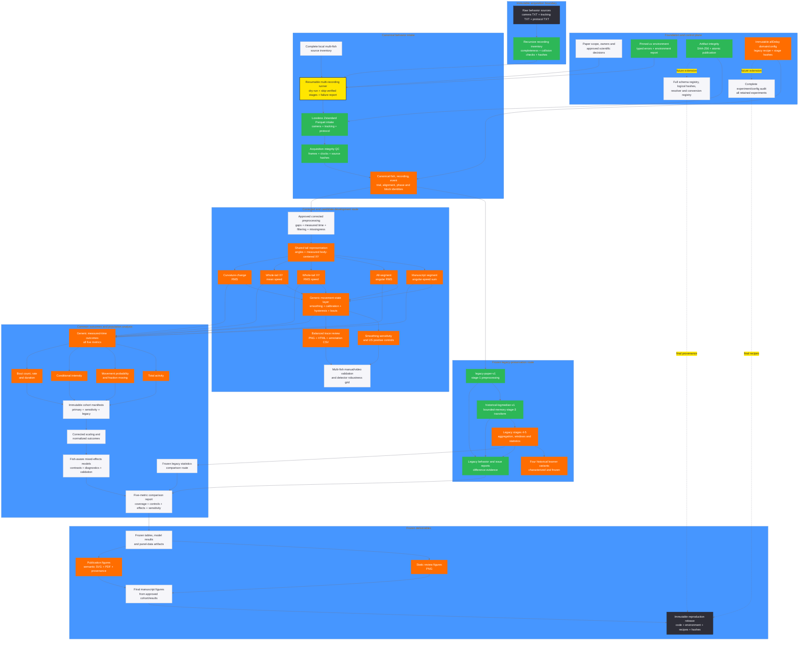
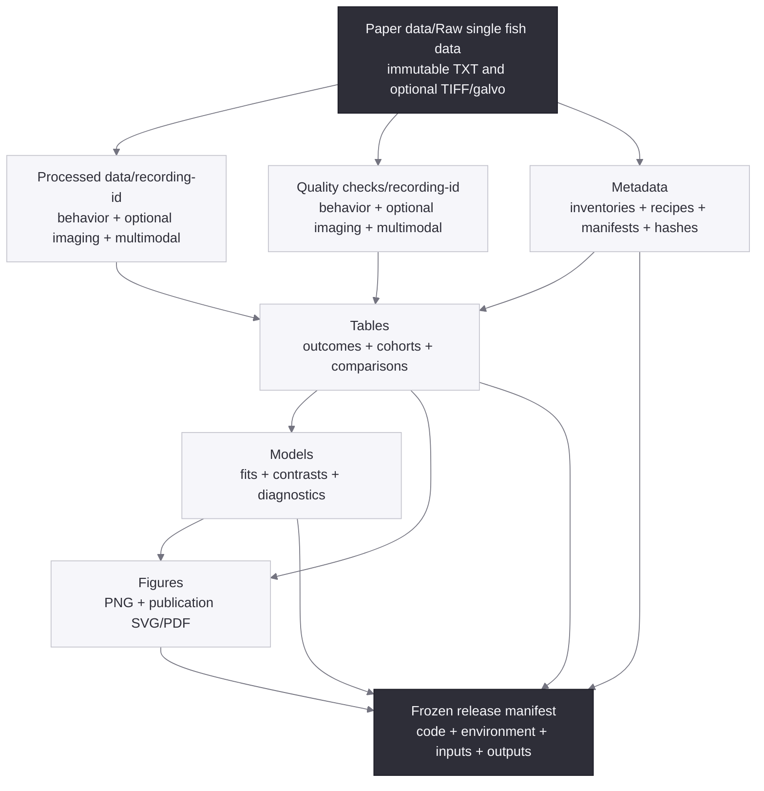

# Final Architecture and Current Implementation Map

This map preserves the complete intended architecture while showing what is
implemented now, what exists only as a single-recording candidate, what should
be implemented next, and what remains planned or deliberately deferred.

All execution is local. Raw scientific data is immutable. Behavior is the
required primary modality; imaging is optional and additive.

## Status legend

| Style | Meaning |
| --- | --- |
| Green | Implemented, tested, and locally runnable |
| Orange | Implemented on bounded pilot/prototype inputs; not paper-authoritative |
| Yellow | Immediate implementation priority |
| Off white | Preserved final-plan work not implemented yet |
| Purple | Explicitly deferred optional work |
| Dark | Immutable boundary or final release boundary |

## Complete behavior architecture with current status



## Optional imaging and learner extensions

These branches remain part of the complete architecture. They are not required
to complete the current five-metric behavior comparison.

```mermaid
%%{init: {'theme': 'base', 'themeVariables': {'primaryColor': '#F6F6FA', 'primaryTextColor': '#2E2E38', 'primaryBorderColor': '#C4C4CD', 'lineColor': '#747480', 'secondaryColor': '#FFE600', 'tertiaryColor': '#4696FF', 'fontFamily': 'Arial, Noto Sans, sans-serif'}}}%%
graph LR
    subgraph BEHAVIOR["Frozen behavior outputs"]
        BO["Behavior trial/fish outcomes"]:::planned
        BC["Behavior-primary cohort"]:::planned
        BR["Behavior release"]:::boundary
    end

    subgraph LEARNER["Deferred learner-methodology track"]
        LQ["Question whether discrete<br/>single-fish classification is justified"]:::deferred
        LA["Compare continuous scores, trajectories,<br/>mixtures, PCA and hierarchical alternatives"]:::deferred
        LV["Power, simulation and<br/>held-out validation"]:::deferred
        LO["Optional learner outputs<br/>only if scientifically retained"]:::deferred
    end

    subgraph IMAGING["Deferred optional imaging track I00-I12"]
        IR["Immutable TIFF + galvo<br/>+ anatomy sources"]:::boundary
        II["Imaging intake<br/>source and array validation"]:::deferred
        SY["Clock/event synchronization<br/>residuals + uncertainty"]:::deferred
        RG["Within/across-trial registration<br/>and motion correction"]:::deferred
        IQ["Frame, trial and plane QC"]:::deferred
        PX["Pixel response maps"]:::deferred
        ROI{"Approved ROI route"}:::deferred
        S2["Suite2p cell route"]:::deferred
        CR["Correlation-grown ROI route<br/>experimental"]:::deferred
        IO["Imaging trial, plane<br/>and ROI outcomes"]:::deferred
        JOIN["Behavior-primary left join<br/>missing imaging is unavailable, not zero"]:::deferred
        MC["Imaging-valid and<br/>multimodal cohorts"]:::deferred
        MS["Imaging and cross-modal<br/>fish-aware statistics"]:::deferred
        MR["Optional multimodal<br/>release extension"]:::boundary
    end

    BO --> LQ --> LA --> LV --> LO
    BC --> LQ
    IR --> II --> SY --> RG --> IQ --> PX
    IQ --> ROI
    ROI --> S2 --> IO
    ROI --> CR --> IO
    BO --> JOIN
    IO --> JOIN
    BC --> JOIN
    JOIN --> MC --> MS --> MR
    BR --> MR

    classDef implemented fill:#2DB757,stroke:#2DB757,stroke-width:1px,color:#FFFFFF
    classDef pilot fill:#FF6D00,stroke:#FF6D00,stroke-width:1px,color:#FFFFFF
    classDef priority fill:#FFE600,stroke:#2E2E38,stroke-width:2px,color:#2E2E38
    classDef planned fill:#F6F6FA,stroke:#C4C4CD,stroke-width:1px,color:#2E2E38
    classDef deferred fill:#3D108A,stroke:#3D108A,stroke-width:1px,color:#FFFFFF
    classDef boundary fill:#2E2E38,stroke:#1A1A24,stroke-width:1px,color:#F6F6FA
```



Required behavior/imaging invariant:

```text
behavior outputs with imaging disabled
    == behavior outputs with imaging enabled
```

Imaging may consume canonical behavior clocks, event identities, and outcomes.
It may never recalculate, overwrite, exclude, or redefine behavior artifacts or
the behavior-primary cohort.

## Current runnable reality

```mermaid
%%{init: {'theme': 'base', 'themeVariables': {'primaryColor': '#F6F6FA', 'primaryTextColor': '#2E2E38', 'primaryBorderColor': '#C4C4CD', 'lineColor': '#747480', 'secondaryColor': '#FFE600', 'tertiaryColor': '#4696FF', 'fontFamily': 'Arial, Noto Sans, sans-serif'}}}%%
graph LR
    NOW["One local complete recording<br/>20221115_04"]:::boundary
    I["Authenticated inventory"]:::implemented
    P["Lossless Parquet + QC"]:::implemented
    L["Legacy stage 1 + LogMedian"]:::implemented
    F["Five candidate frame metrics"]:::pilot
    M["Movement + sensitivity<br/>+ trace review"]:::pilot
    O["Five-metric temporal outcomes"]:::pilot
    G["PNG + semantic SVG/PDF<br/>rendering infrastructure"]:::pilot
    N["Next: resumable<br/>multi-recording runner"]:::priority
    NEED["Needs additional local raw recordings<br/>for cohort-scale execution"]:::planned
    C["Then: cohort + scaling<br/>+ statistics + comparison"]:::planned

    NOW --> I --> P
    P --> L
    P --> F --> M --> O --> G
    G --> N --> NEED --> C

    classDef implemented fill:#2DB757,stroke:#2DB757,stroke-width:1px,color:#FFFFFF
    classDef pilot fill:#FF6D00,stroke:#FF6D00,stroke-width:1px,color:#FFFFFF
    classDef priority fill:#FFE600,stroke:#2E2E38,stroke-width:2px,color:#2E2E38
    classDef planned fill:#F6F6FA,stroke:#C4C4CD,stroke-width:1px,color:#2E2E38
    classDef boundary fill:#2E2E38,stroke:#1A1A24,stroke-width:1px,color:#F6F6FA
```



## Final storage architecture



## Immediate priority lane

The complete architecture above remains authoritative. Current execution
priority is narrower:

1. Implement the resumable multi-recording runner.
2. Make the remaining local raw recording triplets available and inventory them.
3. Run identical legacy and five-metric candidate stages for every recording.
4. Freeze and compare primary, sensitivity, and legacy cohorts.
5. Run identical fish-aware models for all five metrics.
6. Produce the comparison report and final PNG/SVG/PDF figures.
7. Revisit learner methodology only after the behavior results are frozen.
8. Implement the optional imaging branch later without changing behavior hashes.

