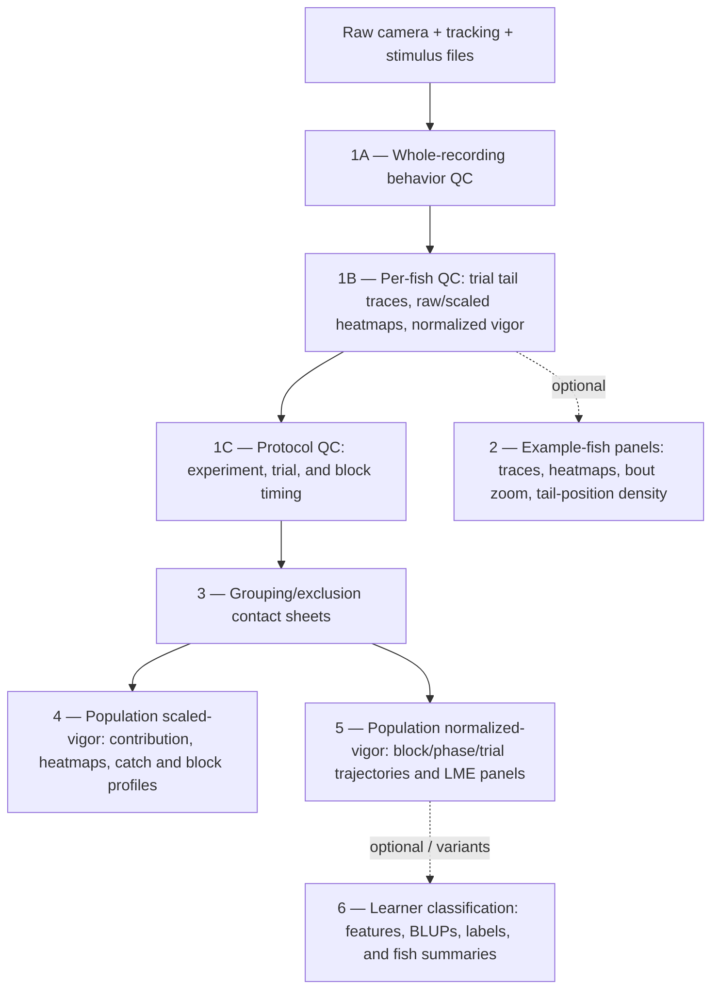
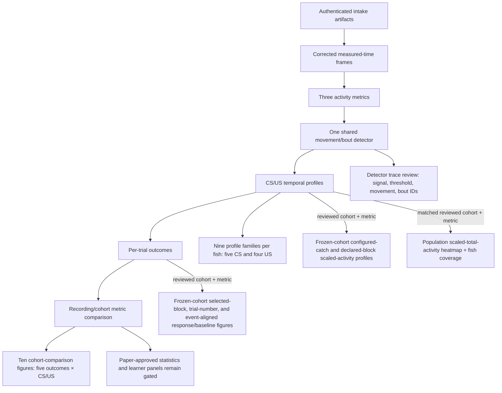

# Figure pipeline inventory and historical comparison

This is the durable visual inventory for the legacy analysis and the supported
refactored candidate workflow. It describes what each pipeline can render and
where coverage differs; it does not approve scientific outcomes, cohorts, or
inferential models. Those decisions live in
[the analysis and statistics plan](../../../Plans/02_ANALYSIS_AND_STATISTICS.md).

The archive inventory reflects the preserved historical scripts. A figure
family may create many files because legacy scripts loop over fish, condition,
alignment, trial, or block. The sequence is logical, not a guarantee that every
optional legacy family was rendered in a given run.
The `R1`–`R13` identifiers below mean **refactored figure families**; they are
not release stages.

## Legacy figure pipeline

| Order | Figure family | Purpose |
| ---: | --- | --- |
| 1.1–1.5 | Recording and per-fish behavior QC | Find tracking, alignment, and gross activity failures. |
| 1.6–1.8 | Protocol QC | Verify CS/US timing at experiment, trial, and block level. |
| 2.1–2.9 | Example-fish panels | Show selected traces, heatmaps, bouts, and tail configurations. |
| 3.1 | Inclusion/exclusion contact sheets | Review grouping decisions using rendered heatmaps. |
| 4.1–4.5 | Population scaled vigor | Describe trial/time activity and catch/block temporal profiles. |
| 5.1–5.4 | Population normalized vigor | Show fish, condition, block, phase, and trial summaries with legacy statistics. |
| 6.1–6.7 | Learner diagnostics | Explore classifier features, uncertainty, labels, and individual summaries. |

Stage 2 does not feed stages 3–6. Learner outputs have several materially
different historical implementations and no single canonical legacy set.

## Refactored figure pipeline

| Order | Figure family | Purpose |
| ---: | --- | --- |
| R1 | Detector trace review | Review rest, movement, disagreement, and US windows. |
| R2 | Raw total-activity profile | Per-recording trial-by-time heatmaps for all three metrics. |
| R3 | Scaled total-activity profile | Compare metrics using the declared display scaling. |
| R4 | Signed log-vigor profile (CS only) | Show bout-median log vigor centered on the trial pre-CS median; fixed signed display scale. |
| R5 | Conditional-intensity profile | Show activity magnitude while the shared detector reports movement. |
| R6 | Bout-outcome profile | Show movement probability, occupancy, and bout-initiation rate. |
| R7 | Cohort metric comparison | Compare standardized response-versus-baseline differences by fish and condition. |
| R8 | Selected-block response/baseline ratio | Show fish medians and condition median [IQR] for final Pre-train 10–14, Early Test 65–69, and Late Test 90–94. |
| R9 | Trial-number response/baseline ratio | Show the requested fish-weighted learning trajectory across CS trials. |
| R10 | Event-aligned response/baseline ratio | Show fish-normalised time courses and condition median [IQR]. |
| R11 | Configured-catch scaled-activity profile | Pool CS 25, 39, 53, 59, and first-Early-Test catch 65 within fish, then summarize fish equally. |
| R12 | Declared ten-trial block profiles | Show every experiment-declared CS block with trials pooled within fish and coverage retained. |
| R13 | Matched population heatmap | Equal-fish 0–1 scaled total activity across all valid frames, with contributing-fish fraction and panel-data counts. |

The routine pipeline schedules R1–R7 whenever each family has authenticated
inputs, R8–R12 when a frozen cohort ID and selected metric are supplied, and
R13 when that frozen cohort contains one paired condition and its matched control.
Every unmet family has an explicit blocked reason in the run summary. R8–R12
are descriptive and do not annotate the current diagnostic LME.
Static PNG and publication SVG/PDF
are maintained.
Interactive HTML is frozen and receives no further feature development.

## Coverage and differences

| Dimension | Legacy | Refactored |
| --- | --- | --- |
| Primary signal | One historical distal vigor | Three explicit activity metrics |
| Movement segmentation | Embedded and reused across scripts | One declared shared detector |
| Rendering boundary | Mixed into preprocessing, aggregation, and inference | Renders authenticated saved artifacts |
| Rest | Often treated as missing | Separated into total activity and movement outcomes |
| Cohort | Stage-specific exclusions | Frozen-manifest infrastructure and a single cohort-applied population artifact exist; the reviewed paper cohort is still missing |
| Statistics | Ratio tests and many block/trial models | Exploratory LME/permutation/bootstrap scaffolds plus a condition-aware learning-onset route; paper approval remains open |
| Coverage | Broad QC, population, and learner catalog | Detector/metric profiles and descriptive cohort comparison |

The refactor now restores the legacy catch/block temporal-profile roles with a
different, explicit estimand: authenticated scaled total activity, coverage
masking, trials pooled within fish, and equal-fish cohort aggregation. It does
not yet replace learner-classification figures or make the profiles
confirmatory evidence.

The proposed manuscript Figure 1–4 mapping and exact draft differences are in
[the paper draft comparison](./05_DRAFT_COMPARISON.md). The written scaffold
and figure list, not draft panel placement, define intended Figure 1 and 4.

The machine-readable [paper review variant registry](../../../configs/paper-figures/review-variants.json)
lists every Figure 1 and Delay/control Figure 2 version generated during the
current visual review, with its renderer, output family, and reproducibility
status. It is linked from the proposed paper panel registry. Review variants
are not approved manuscript panels. Superseded PNGs whose exact source revision
is unavailable are explicitly marked as retained historical outputs.

The [version-by-version comparison](./04_REVIEW_VARIANTS.md) records scaling,
baseline, signal and palette parameters. The [paper figure freeze record](./02_PAPER_FIGURE_SPECIFICATION.md)
maps all main and supplementary panels to their implementation and open gates.
Its `render-paper-panels` command is the integrated rendering entry point for
the currently supported paper review panels. Its Figure 1 E and Figure 2 A
vigor heatmaps now share signed bout-log-vigor fish/trial bins and `managua_r`
at −0.25…+0.25; Figure 2 averages available fish bins equally. Supplementary
coverage uses `managua_r` with a separate 0…1 fraction scale. The routine R13
all-valid-frame 0–1 heatmap remains a different descriptive figure family.
The maintained and historical scripts are catalogued in
[`scripts/README.md`](../../../scripts/README.md).

## Related implementation and decisions

- [Figures and reproducible reporting](../../../Plans/08_FIGURES_AND_REPRODUCIBLE_REPORTING.md)
  owns paper registries, supported rendering interfaces, panels, validation,
  and final figure outputs for the analysis release.
- [Analysis and statistics](../../../Plans/02_ANALYSIS_AND_STATISTICS.md)
  owns Gate O/S decisions and prerequisites for confirmatory results.
- [Learner representation and analysis](../../../Plans/05_LEARNER_ANALYSIS.md)
  owns learner-panel inputs and validation status.
